Lumino
==========

Lumino is an open source library for building interactive applications such as games and digital art.
It provides a simple API that runs on multiple platforms and is available for multiple programming languages.

Lumino はゲームやデジタルアートなどのインタラクティブアプリケーションを構築するためのオープンソースライブラリです。
マルチプラットフォームで動作し複数のプログラミング言語から利用できる、シンプルな API を提供します。

Build and Unit Tests
----------

[](https://github.com/LuminoEngine/Lumino/actions)

Quick-start
----------

```
dotnet run -- BuildEngine_MSVC --components=core
```

TODO:

Get started
----------

🌏 [Website](https://luminoengine.github.io/)

🛠 [How to build](docs/HowToBuild.md)

[Roadmap](docs/Roadmap.md)

[Contributing](.github/CONTRIBUTING.md)

[Blog](http://luminolog.hatenablog.com/)


開発状況と目標
----------

Lumino はまだまだ開発途中であり、一般にリリースできる段階にはありません。しかし全体的なアーキテクチャは、いくつかの高度な視覚表現を実装した [ゲーム](https://www.youtube.com/watch?v=S1c5A8C3OGM&feature=youtu.be) を安定してリリースできるレベルまでまとまってきました。 Lumino の開発中のバージョンは [Website](https://luminoengine.github.io/) から試すことができます。

直近では、簡単に使い始められるようにするため、またどんな機能があるか分かりやすくするため、以下の目標で開発を進めています。

- ドキュメント (チュートリアルやサンプル) を充実させる。
- 開発中ゲームからのフィードバックを反映する。
- 主要なプラットフォームに対応する。 (現在は Linux 版が手つかず)

一方、これまではプログラマではなくてもゲームを開発できるような汎用ゲームエンジンを目指していましたが、その目標を見直しています。
まだ明確ではありませんが、学習や研究開発、簡易的なデータビジュアライゼーション、小規模なゲーム・アート作品等、ちいさなものをコードファーストで素早く開発できる、プログラマ向けのライブラリセットを目指そうとしています。直近では次のような計画があります。

- ランタイムで様々なアセットを動的生成する機能
- 動画再生
- 各種通信対応 (HTTP, TCP/UDP, UART)
- 各種デバイス対応 (マルチタッチ, ペンタブ, カメラ, AR/VR)

コミュニティ
----------

TODO

Screenshots
--------
参考のため、開発の中で撮れた画像を置いておきます。

#### Scene rendering

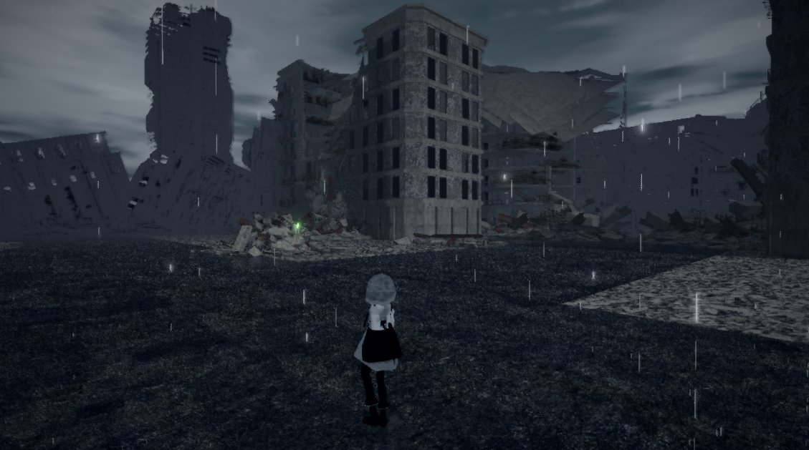

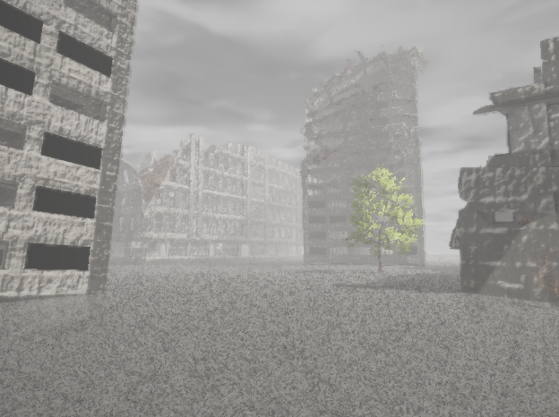

#### VRM + BVH

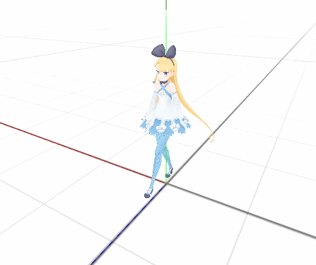

#### Soft Shadow

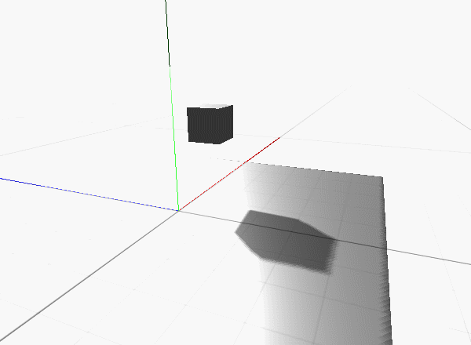

#### Depth of field


### Character Controller


### Mirror

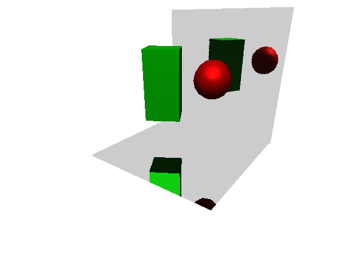

### Screen Space Reflection


### Sky


### Particle Rain


### Transition Effect


### 3D Tilemap


### Post Effect (ToneChange, Bloom)

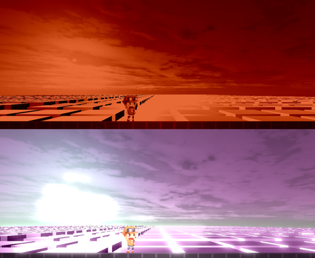

### 3D Text and Emoji

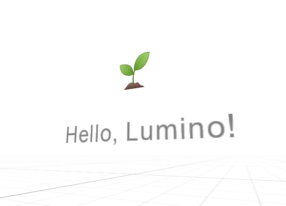

### Fantastic Ocean


### Voxel Map


### Web Platform

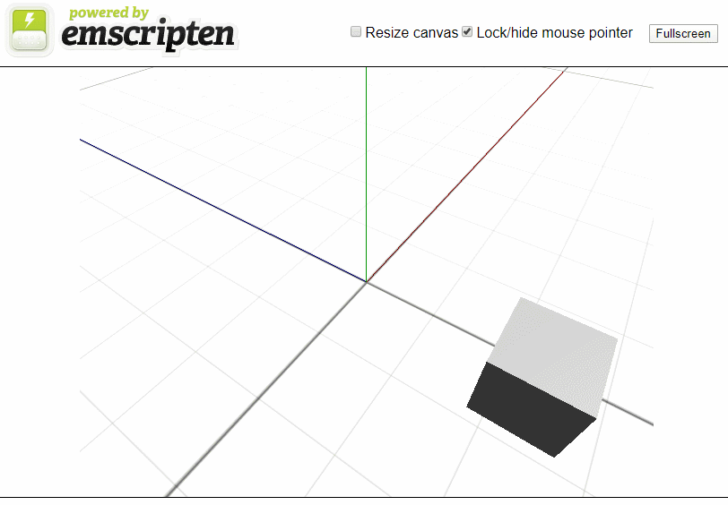

### Effekseer

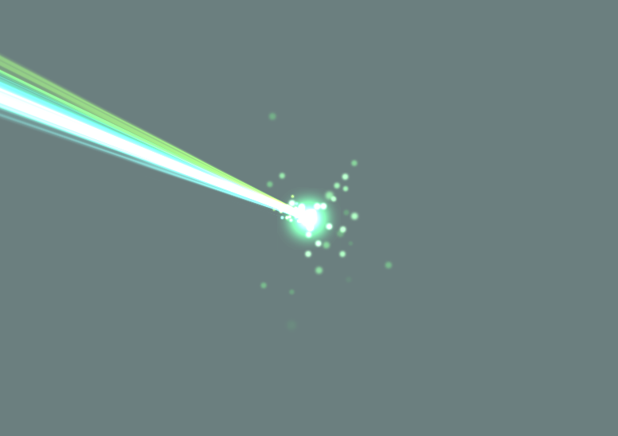

### 2D Action


### Tilemap Editor


### Materials

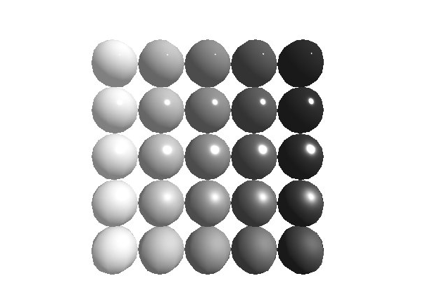

### Fog

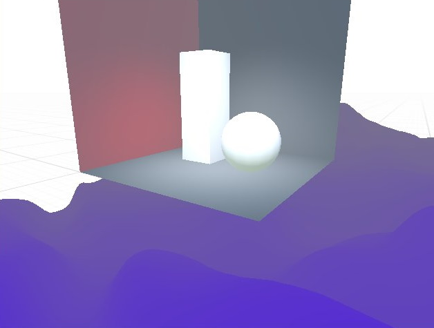

### Tilemap

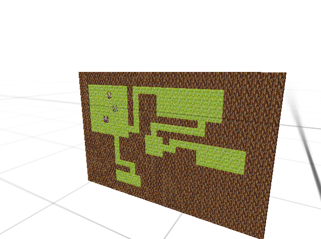

### SoftBody

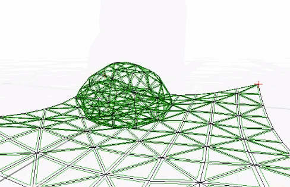

### 3D Sprites


### Morphing

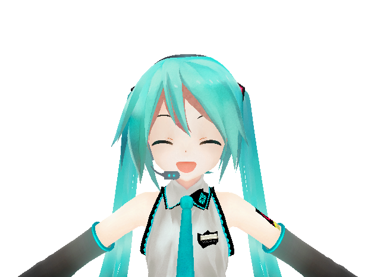

### MMD Model


### Multi Lights


### Atmosphere


### Mirror


### 3D Sprite Character

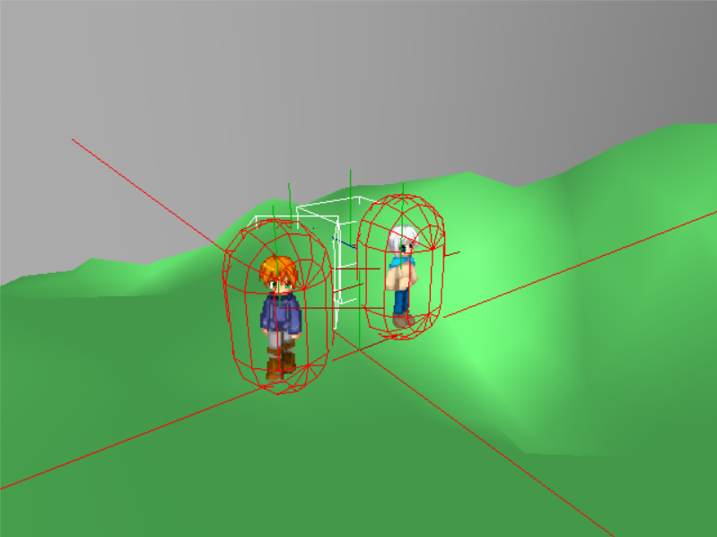

### Pixel Shader


