Lumino
==========

Lumino is an open source library for building interactive applications such as games and digital art.
It provides a simple API that runs on multiple platforms and is available for multiple programming languages.

Lumino はゲームやデジタルアートなどのインタラクティブアプリケーションを構築するためのオープンソースライブラリです。
マルチプラットフォームで動作し複数のプログラミング言語から利用できる、シンプルな API を提供します。

## 💡 Project Status

Lumino is currently being developed with the following two use cases in mind.

- A. Use basic modules (String, Array, FileSystem, etc.) in IoT platforms and testing tools.

- B. Use interaction modules (Graphics, Audio, Input, etc.) in other game engines and applications.

Until v0.10.1, Lumino was developed as a standalone game engine, and the main motivation was technical exploration.

In recent years, developers have been busy and maintenance has become difficult. However, there are opportunities to obtain investments, albeit on a small scale, and we would like to focus on them in the future.

The future development concept is as follows.

- We aim to create an easy API for users who are not familiar with C++. For example, we will make it easy to predict and difficult to make mistakes for programmers who usually use C# or JavaScript but write C++ out of necessity.

- We will abolish all framework-like functions. For example, game UI and scene graphs. (We realized that it is more convenient overall to write these functions in client-side programming languages.)

Lumino は現在、次の2つのユースケースを想定して開発を続けています。

- A. 基礎的なモジュール (String, Array, FileSystem, 等) を IoTプラットフォームやテスティングツール で利用する。
- B. インタラクションモジュール (Graphics, Audio, Input 等) を 他のゲームエンジンやアプリケーションで利用する。

v0.10.1 までの Lumino はスタンドアロンゲームエンジンとして開発を続けていましたが、その主な動機は技術的探求でした。

ここ数年は開発者が忙しく、メンテナンスが難しくなっていました。しかし、小規模ながら投資を得られる機会があり、今後はそれらにフォーカスしたいと考えています。

今後の開発コンセプトは次の通りです。

- C++ に詳しくないユーザーにとって簡単な API を目指します。例えば普段は C# や JavaScript を使っていますが、必要に迫られて C++ を書くようなプログラマが、予想しやすく間違い辛いようにします。
- フレームワークのような機能をすべて廃止します。例えばゲームUIやシーングラフです。（これらの機能はクライアント側のプログラム言語で書いた方が、トータルで都合が良いことに気づきました）

-----

## Build and Unit Tests

[](https://github.com/LuminoEngine/Lumino/actions)

### Web

```
dotnet tool install dotnet-script -g
dotnet script scripts/PrepareWebGPU.csx
dotnet run -- BuildEngine wasm32-emscripten
```

CMake の成果物 (.wasm 等) は `📁build/installed/wasm32-emscripten` に出力されます。

ローカルで Dawn を用いた動作確認をするには `LUMINO_USE_WEBGPU` を ON にして cmake を実行してください。


Quick-start
----------

とりあえず使ってみたい方へ。(CMake)

1. .NET SDK をインストールする。
2. このリポジトリをクローンする。
3. 次のコマンドで Lumino をビルドする。
    ```
    dotnet run -- BuildEngine
    ```
4. CMakeLists.txt で `ImportLumino.cmake` を include し、 LuminoEngine がリンクする。
    ```cmake
    cmake_minimum_required(VERSION 3.15)
    project(TestProject)
    include(ImportLumino.cmake)    # Path to repository root.

    add_executable(${PROJECT_NAME} Main.cpp)
    target_link_libraries(${PROJECT_NAME} PRIVATE LuminoEngine)
    ```

実際の例: `tools/TestProjects/CMake`

Get started (⚠️少し情報が古いです)
----------

🌏 [Website](https://luminoengine.github.io/) 

🛠 [How to build](docs/HowToBuild.md)

[Roadmap](docs/Roadmap.md)

[Contributing](.github/CONTRIBUTING.md)

🛡️ [API design policy](docs/APIDesignPolicy.md)

[Blog](http://luminolog.hatenablog.com/)


開発状況と目標
----------

Lumino はまだまだ開発途中であり、一般にリリースできる段階にはありません。しかし全体的なアーキテクチャは、いくつかの高度な視覚表現を実装した [ゲーム](https://www.youtube.com/watch?v=S1c5A8C3OGM&feature=youtu.be) を安定してリリースできるレベルまでまとまってきました。 Lumino の開発中のバージョンは [Website](https://luminoengine.github.io/) から試すことができます。

直近では、簡単に使い始められるようにするため、またどんな機能があるか分かりやすくするため、以下の目標で開発を進めています。

- ドキュメント (チュートリアルやサンプル) を充実させる。
- 開発中ゲームからのフィードバックを反映する。
- 主要なプラットフォームに対応する。 (現在は Linux 版が手つかず)

一方、これまではプログラマではなくてもゲームを開発できるような汎用ゲームエンジンを目指していましたが、その目標を見直しています。
まだ明確ではありませんが、学習や研究開発、簡易的なデータビジュアライゼーション、小規模なゲーム・アート作品等、ちいさなものをコードファーストで素早く開発できる、プログラマ向けのライブラリセットを目指そうとしています。直近では次のような計画があります。

- ランタイムで様々なアセットを動的生成する機能
- 動画再生
- 各種通信対応 (HTTP, TCP/UDP, UART)
- 各種デバイス対応 (マルチタッチ, ペンタブ, カメラ, AR/VR)

コミュニティ
----------

TODO

Screenshots
--------
参考のため、開発の中で撮れた画像を置いておきます。

#### Scene rendering

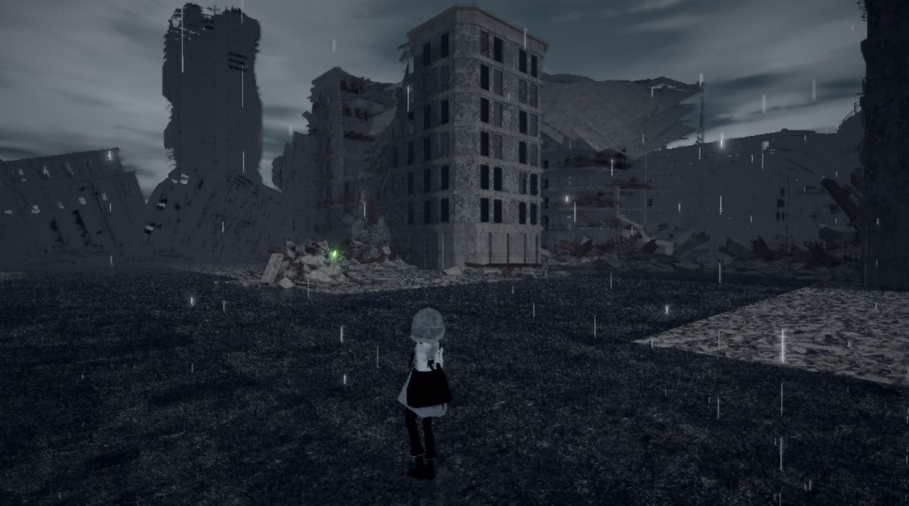

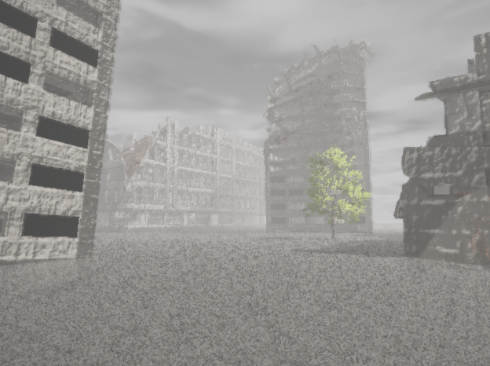

#### VRM + BVH

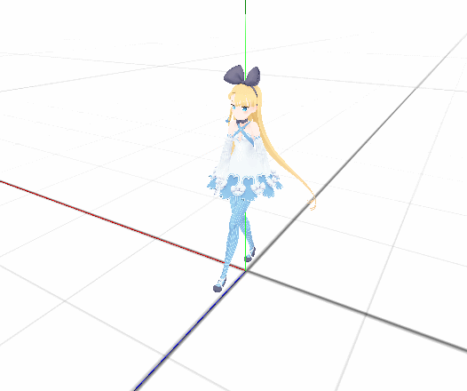

#### Soft Shadow

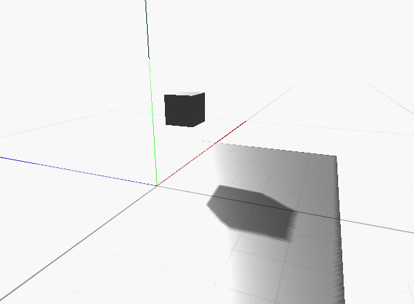

#### Depth of field

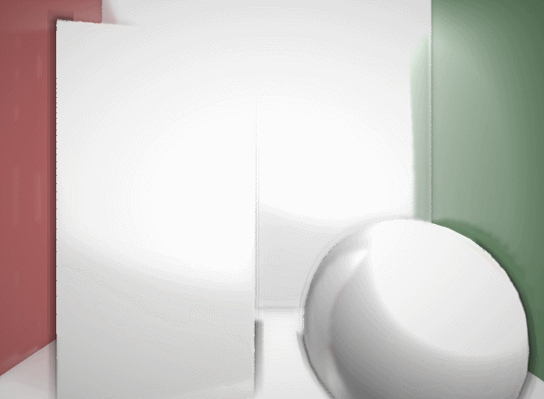

### Character Controller


### Mirror

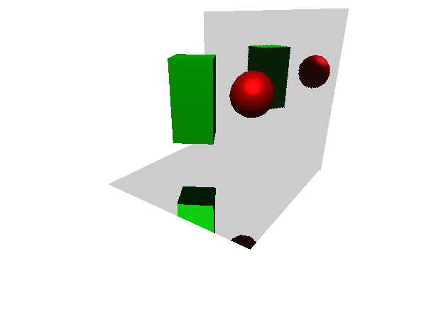

### Screen Space Reflection

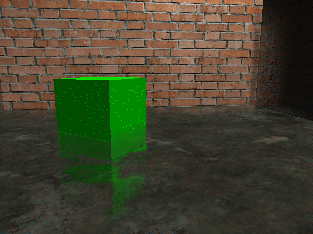

### Sky


### Particle Rain

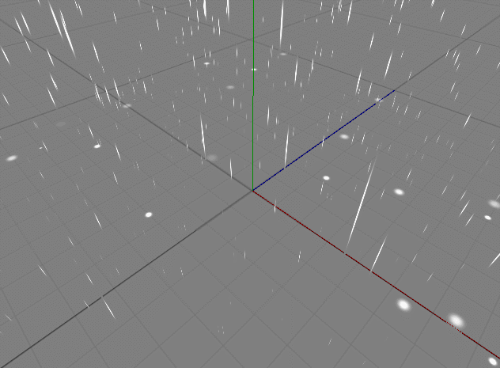

### Transition Effect


### 3D Tilemap


### Post Effect (ToneChange, Bloom)

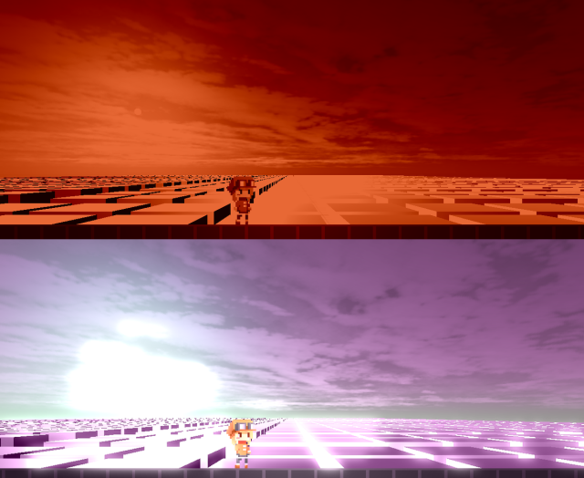

### 3D Text and Emoji

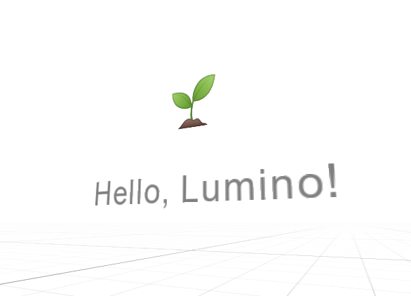

### Fantastic Ocean


### Voxel Map

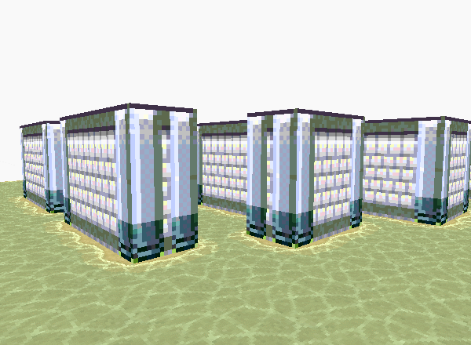

### Web Platform

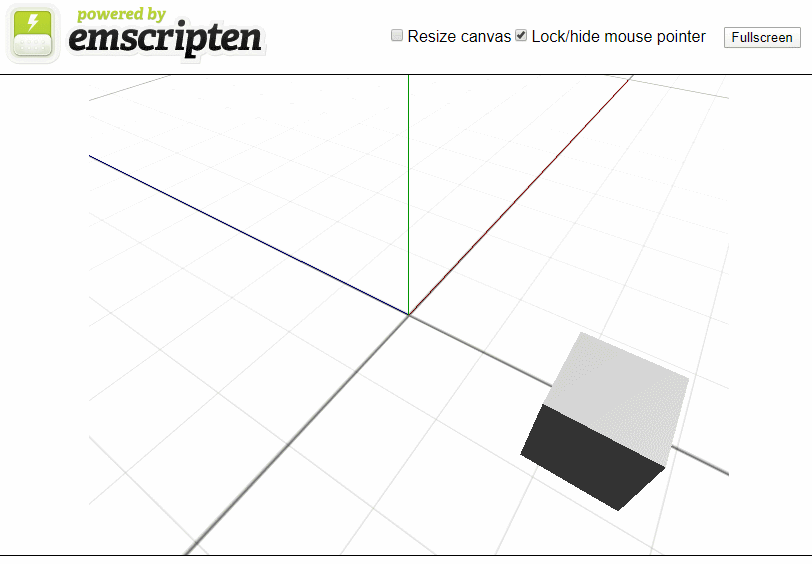

### Effekseer

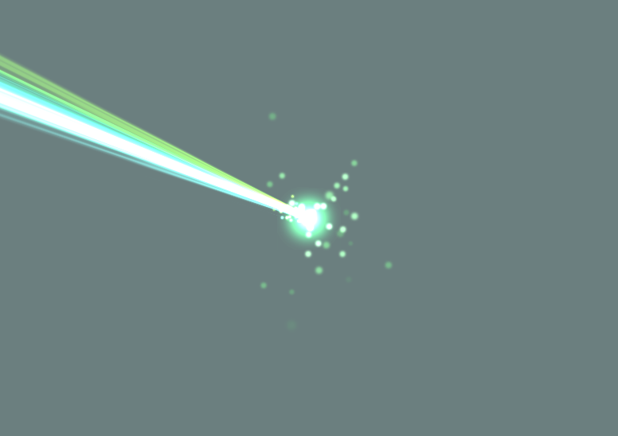

### 2D Action
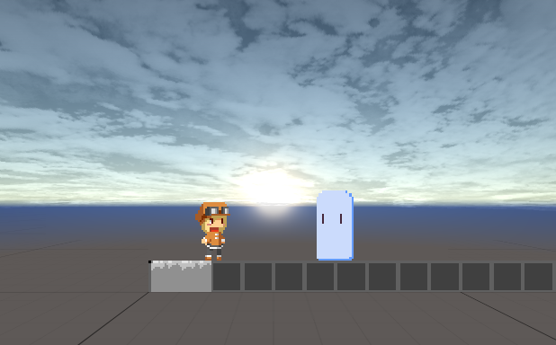

### Tilemap Editor

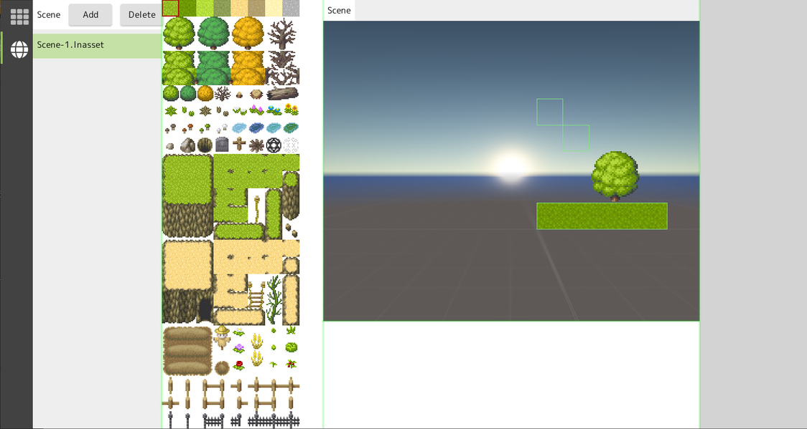

### Materials

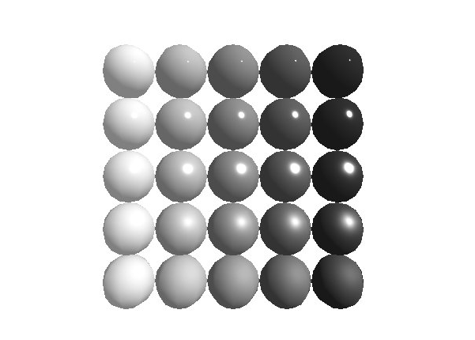

### Fog

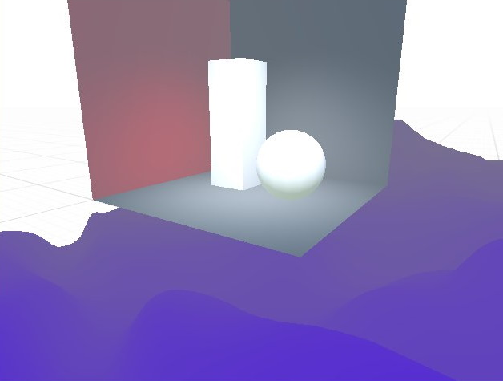

### Tilemap

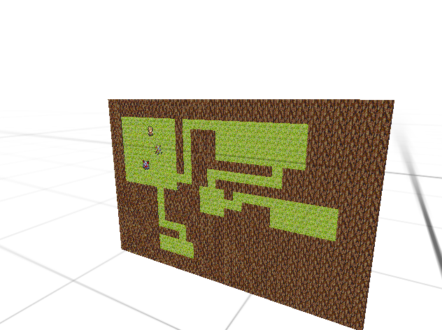

### SoftBody

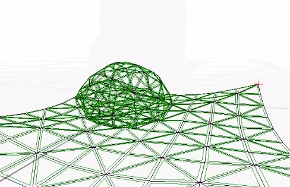

### 3D Sprites

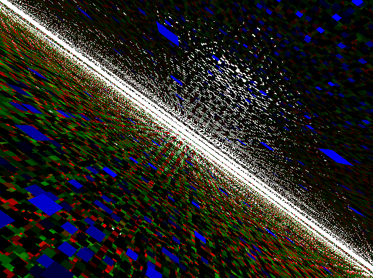

### Morphing

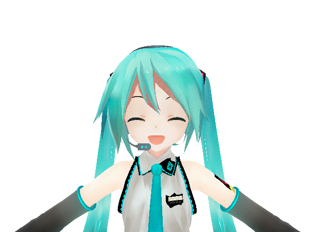

### MMD Model

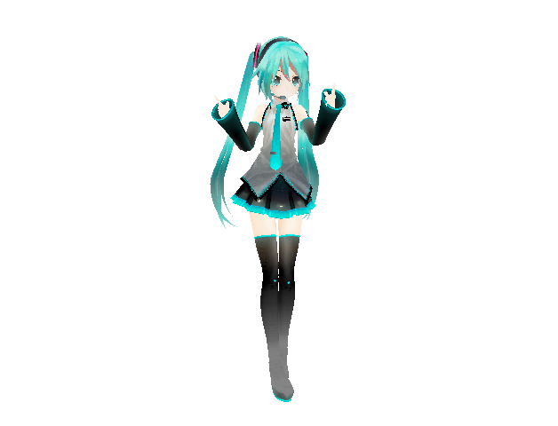

### Multi Lights

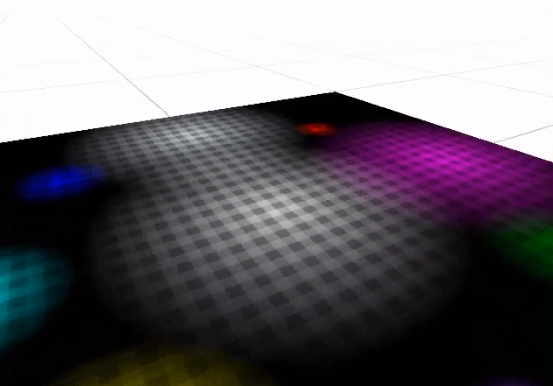

### Atmosphere

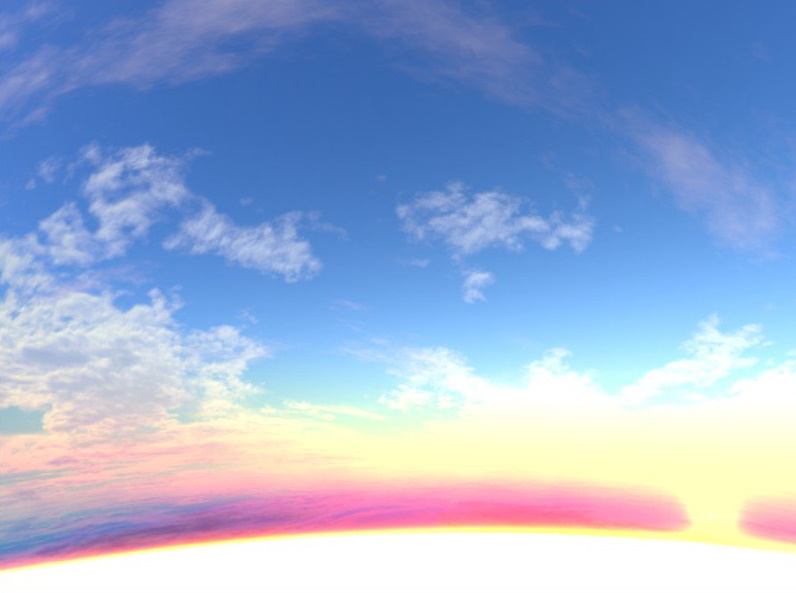

### Mirror

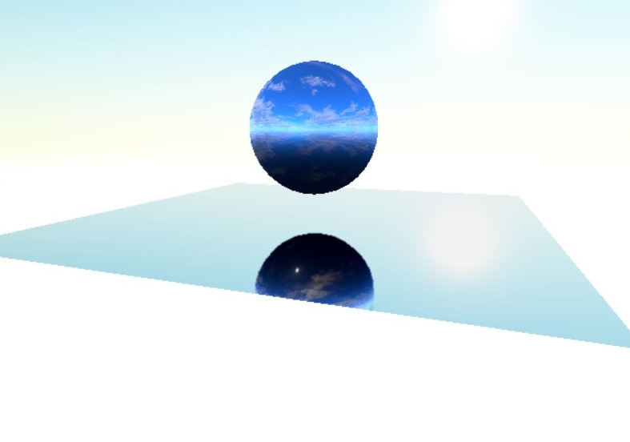

### 3D Sprite Character

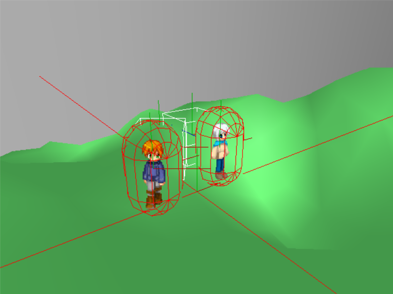

### Pixel Shader

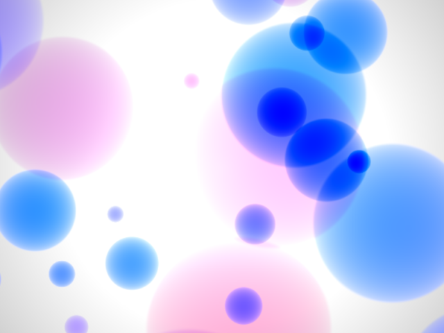


