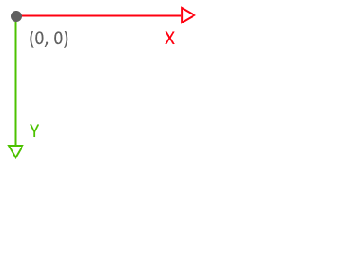
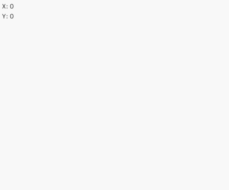
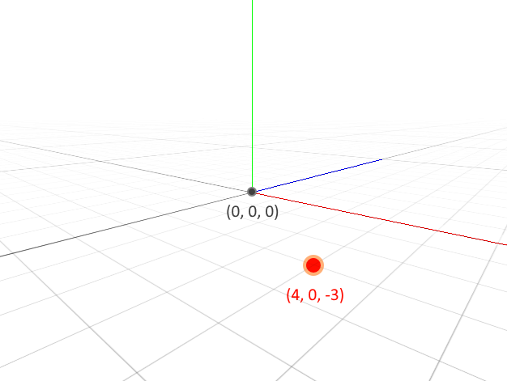
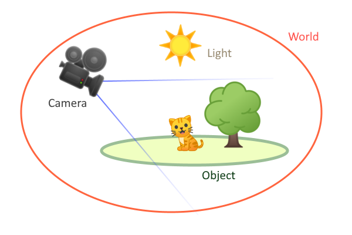
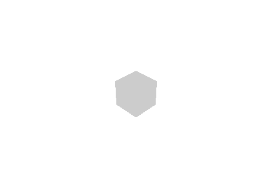
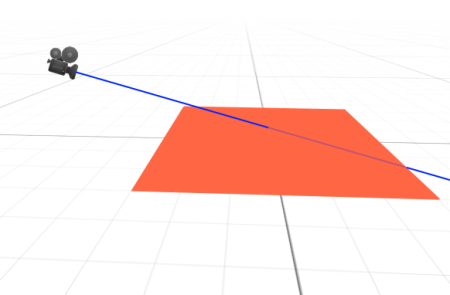
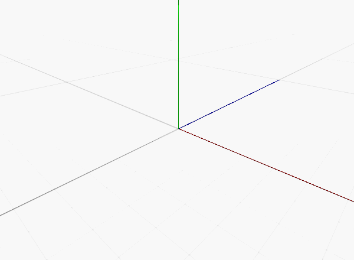

描画の基本
==========

この章では、画面上に図形や絵を表示するための基礎を学びます。

2D 座標系
----------

ウィンドウに描画されるものは座標系に従います。

座標系はウィンドウの左上隅を X 座標 0、X 座標 0 として、X と Y の値は右下に向かって大きくなります。



座標を確認するため、`Mouse::position` を使って現在のマウスカーソルの座標を表示してみます。

# [C++](#tab/lang-cpp)
```cpp
#include <Lumino.hpp>

class App : public Application
{
    virtual void onUpdate() override
    {
        Debug::print(0, String::format(u"X: {0}", Mouse::position().x));
        Debug::print(0, String::format(u"Y: {0}", Mouse::position().y));
    }
};

LUMINO_APP(App);
```
# [Ruby](#tab/lang-ruby)
```ruby
require 'lumino'

class App < Application
    def on_update
        Debug.print(0, "X:%f" % [Mouse.pos.x]));
        Debug.print(0, "Y:%f" % [Mouse.pos.y]));
    end
end

App.new.run
```
---




Lumino において 2D 座標系を使うのは、主に テキストやボタンといった UI (ユーザーインターフェイス) を作成するときです。UI についてはチュートリアルの中盤で触れます。

ゲーム開発のためのキャラクターや背景の表示には、次の 3D 座標系を主に使用します。


3D 座標系
----------

Lumino の 3D 空間は、X軸,Y軸,Z軸 からなる直交座標系によって定められます。

位置は 3次元ベクトル(x, y, z) で表され、例えば (4, 0, -3) は、地平面上の座標 (4, -3) と高さ 0 を意味します。



この図では、X軸は <span style="color:red">赤</span> の線、Y軸は <span style="color:green">緑</span> の線、Z軸は <span style="color:blue">青</span> の線で表しています。中心を (0, 0, 0) とし、線の延びる方向を正の値とします。

このように X+方向 を右、Y+方向を上、Z+方向を奥行き(前方) とする座標系を `左手座標系` と呼び、Lumino はこれを基本としています。


3D の構成要素
----------

様々なオブジェクトを配置し、3D 空間にシーンを作り上げるための舞台を `ワールド` と呼びます。

ワールドは非常に多くの機能を持っていますが、その中でも特に重要なものは次の通りです。

- オブジェクト
- カメラ
- ライト
- マテリアル

直方体や球体などの3Dオブジェクトやモデリングデータなどを `オブジェクト` (あるいは `WorldObject`) とよび、これらはすべてワールドの中に配置します。

また、3D 空間を 2D のウィンドウ上に写し出す機能を `カメラ` と呼びます。

`ライト` と `マテリアル` はオブジェクトに色や陰影を持たせ、シーンを印象的なものにするための機能です。

映画などの撮影のように役者(オブジェクト) を配置して、カメラマンがどの位置から撮影するか、照明をどのように当てるかを決めることでシーンが作られるのと同じようなイメージです。



このページではオブジェクトとカメラについて説明します。

オブジェクトを作成する
----------

オブジェクトは物体の形状や材質を表すパラメータや、ワールド内の配置場所を示す座標などの情報をまとめたものです。

最初のオブジェクトとして、立方体を表示してみましょう。

# [C++](#tab/lang-cpp)
```cpp
#include <Lumino.hpp>

class App : public Application
{
    virtual void onInit() override
    {
        auto box = BoxMesh::create();
    }
};

LUMINO_APP(App);
```
# [Ruby](#tab/lang-ruby)
```ruby
require 'lumino'

class App < Application
    def on_init
        box = BoxMesh.new
    end
end

App.new.run
```
---


ウィンドウ中央に四角形が表示されました。


カメラを操作する
----------

今はちょうどカメラが立方体を正面から撮影している状態ですが、このままではこの四角形が立方体かどうかを判断できません。

次はカメラを移動して、視点を変えてみましょう。

Lumino の初期状態は、空っぽのワールドにひとつのカメラが配置されています。

このカメラを移動させてみます。

# [C++](#tab/lang-cpp)
デフォルトのカメラは `Engine::camera` で取得し、`setPosition` で 3D 位置を指定します。また、位置を指定した後に `lookAt` でワールドの原点を向くようにします。
```cpp
#include <Lumino.hpp>

class App : public Application
{
    virtual void onInit() override
    {
        auto box = BoxMesh::create();

        auto camera = Engine::camera();
        camera->setPosition(5, 5, -5);
        camera->lookAt(0, 0, 0);
    }
};

LUMINO_APP(App);
```
# [Ruby](#tab/lang-ruby)
デフォルトのカメラは `Engine.camera` で取得し、`set_position` で 3D 位置を指定します。また、位置を指定した後に `look_at` でワールドの原点を向くようにします。
```ruby
require 'lumino'

class App < Application
    def on_init
        box = BoxMesh.new

        camera = Engine.camera
        camera.set_position(5, 5, -5)
        camera.look_at(0, 0, 0)
    end
end

App.new.run
```
---



カメラを座標 (5, 5, -5) に移動し、原点 (0, 0, 0) を注視するようにしました。

立方体を斜め上から見下ろす形になり、立体的に見えるようになりました。


座標系を変換する (2D -> 3D)
----------

マウスで指している位置にオブジェクトを表示したい場合、2D 座標から 3D 座標へ変換する必要があります。

ただし、2D 座標から 3D 座標への変換では、直に 3D の一点を求めることはできません。

カメラが写している 2D 画面上の "点" を 3D 空間で考えると、次のようにカメラから前方へ伸びる "線分" となります。



例えば地平面 (XZ平面) 上の点を求めたい場合、この線分と平面の交差判定を行わなければなりません。

Lumino では線分を使った衝突判定をサポートする `Raycaster` が用意されていますので、これを使ってみます。

> [!Note]
> このような線分のことを `レイ (Ray)` と呼び、レイを使った衝突判定や物体検出を `レイキャスティング (Ray-casting)` と呼びます。

# [C++](#tab/lang-cpp)
```cpp
#include <Lumino.hpp>

class App : public Application
{
    Ref<BoxMesh> box;    // (1)

    virtual void onInit() override
    {
        box = BoxMesh::create();

        auto camera = Engine::camera();
        camera->setPosition(5, 5, -5);
        camera->lookAt(0, 0, 0);
    }

    virtual void onUpdate() override
    {
        auto raycaster = Raycaster::fromScreen(Mouse::position());  // (2)
        if (auto result = raycaster->intersectPlane(0, 1, 0)) {     // (3)
            box->setPosition(result->point());                      // (4)
        }
    }
};

LUMINO_APP(App);
```

1. `onInit()` で作成した box を `onUpdate()` で操作できるようにするため、これまで `auto box = ...;` と定義していたローカル変数ではなくメンバ変数として定義します。
2. スクリーン上の、現在のマウス位置 `Mouse::position()` を起点としてレイキャスティングを行う `Raycaster` インスタンスを取得します。
3. レイと平面との衝突判定を行います。 `intersectPlane()` の引数は面の表方向を表す x, y, z 値です。ここでは、Y+ 方向 （真上）を向く、つまるところ通常の `地平面` を指定しています。
   衝突した場合、結果を返します。衝突しなければ nullptr で、if 内には入りません。
4. `result->point()` で衝突した点を取得できます、これをカメラの時と同じようして `box->setPosition()` にセットすることで、Box を移動させます。

> [!Note]
> これまでは `auto` によって推論されコード上には現れませんでしたが、BoxMesh::create() の戻り値の型は `Ref<BoxMesh>` です。

# [Ruby](#tab/lang-ruby)
```ruby
require 'lumino'

class App < Application
    def on_init
        box = BoxMesh.new

        camera = Engine.camera
        camera.set_position(5, 5, -5)
        camera.lookAt(0, 0, 0)

        light = DirectionalLight.new;
    end
end

App.new.run
```
---


Great!

これまでよりもずっと 3D 空間を触りやすくなりました！


デバッグ
----------

最後に、ワールドのデバッグに使える便利機能を紹介します。

オブジェクトが上手く表示されないようなケースでは、ワールドの状況を観察することが解決の助けになります。（例えば、配置する座標を間違えて、別のオブジェクトの後ろに隠れているだけかもしれません…）

ここでは 3D 空間にグリッドを表示し、カメラをマウスで操作できるようにして、ワールドを俯瞰しやすくしてみます。

# [C++](#tab/lang-cpp)
```cpp
#include <Lumino.hpp>

class App : public Application
{
    Ref<BoxMesh> box;

    virtual void onInit() override
    {
        Engine::renderView()->setGuideGridEnabled(true);
        Engine::camera()->addComponent(CameraOrbitControlComponent::create());

        box = BoxMesh::create();
    }

    virtual void onUpdate() override
    {
        auto raycaster = Raycaster::fromScreen(Mouse::position());
        if (auto result = raycaster->intersectPlane(0, 1, 0)) {
            box->setPosition(result->point());
        }
    }
};

LUMINO_APP(App);
```

onInit() の先頭に2行の新しいコードが増えています。

`Engine::renderView()->setGuideGridEnabled(true);` は、ワールド全体の地平面にグリッドを表示します。また、原点から各軸方向を示す赤、緑、青の線分を表示します。

`Engine::camera()->addComponent(CameraOrbitControlComponent::create());` は、これまで使ってきたカメラに対して、マウスを使って操作できる機能を追加します。


# [Ruby](#tab/lang-ruby)
```ruby
require 'lumino'

class App < Application
    def on_init
        box = BoxMesh.new

        camera = Engine.camera
        camera.set_position(5, 5, -5)
        camera.lookAt(0, 0, 0)

        light = DirectionalLight.new;
    end
end

App.new.run
```
---

マウス操作は次の通りです。

| マウス | 動作 |
|---|---|
| 右ボタンドラッグ | 回転 |
| 中ボタンドラッグ | 平行移動 |
| マウスホイール | 拡大・縮小 |



> [!Note]
> `RenderView` や `Component` など新しい言葉が登場していますが、これらは後のチュートリアルで説明します。
> ここではあくまでデバッグ用としての紹介にとどめています。

> [!Warning]
> ここで紹介したグリッド表示とカメラ操作は実験的な機能です。
>
> 将来的には（機能が使えなくなるということはありませんが）クラスやメソッドの名前が変わる可能性があります。
> Lumino をバージョンアップした際にコンパイルエラーなどが発生する場合は、最新のチュートリアルを参照してください。
