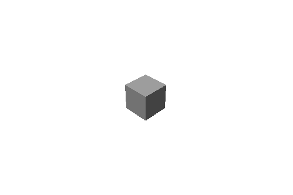

描画の基本
==========

2D 座標系
----------

ウィンドウに描画されるものは座標系に従います。

座標系はウィンドウの左上隅を X 座標 0、X 座標 0 として、X と Y の値は右下に向かって大きくなります。


座標を確認するため、`Mouse::position` を使って現在のマウスカーソルの座標を表示してみます。

# [C++](#tab/lang-cpp)
```cpp
#include <Lumino.hpp>

class App : public Application
{
	virtual void onUpdate() override
	{
		Debug::print(0, String::format(u"X: {0}", Mouse::position().x));
		Debug::print(0, String::format(u"Y: {0}", Mouse::position().y));
	}
};

LUMINO_APP(App);
```
# [Ruby](#tab/lang-ruby)
```ruby
require 'lumino'

class App < Application
    def on_update
        Debug.print(0, "X:%f" % [Mouse.pos.x]));
        Debug.print(0, "Y:%f" % [Mouse.pos.y]));
    end
end

App.new.run
```
---


Lumino において 2D 座標系を使うのは、主に テキストやボタンといった UI (ユーザーインターフェイス) を作成するときです。UI についてはチュートリアルの中盤で触れます。

ゲーム開発のためのキャラクターや背景の表示には、次の 3D 座標系を主に使用します。


3D 座標系
----------

Lumino の 3D 空間は、X軸,Y軸,Z軸 からなる直交座標系によって定められます。

位置は 3次元ベクトル(x, y, z) で表され、例えば (4, 0, -3) は、地平面上の座標 (4, -3) と高さ 0 を意味します。


この図では、X軸は <span style="color:red">赤</span> の線、Y軸は <span style="color:green">緑</span> の線、Z軸は <span style="color:blue">青</span> の線で表しています。中心を (0, 0, 0) とし、線の延びる方向を正の値とします。

このように X+方向 を右、Y+方向を上、Z+方向を奥行き(前方) とする座標系を `左手座標系` と呼び、Lumino はこれを基本としています。


3D の構成要素
----------

様々なオブジェクトを配置し、3D 空間にシーンを作り上げるための舞台を `ワールド` と呼びます。

直方体や球体などの3Dオブジェクトやモデリングデータなどを `オブジェクト` (あるいは `WorldObject`) とよび、これらはすべてワールドの中に配置します。

また、3D 空間を 2D のウィンドウ上に写し出す機能を `カメラ` と呼びます。

`ライト` はオブジェクトに陰影を持たせ、シーンを印象的なものにするための機能です。

映画などの撮影のように役者(オブジェクト) を配置して、カメラマンがどの位置から撮影するか、照明をどのように当てるかを決めることでシーンが作られるのと同じイメージです。


オブジェクトを作成する
----------

オブジェクトは物体の形状を表すパラメータや、ワールド内の配置場所を示す座標などの情報をまとめたものです。

最初のオブジェクトととして、立方体を表示してみましょう。

# [C++](#tab/lang-cpp)
```cpp
#include <Lumino.hpp>

class App : public Application
{
	virtual void onInit() override
	{
		auto box = BoxMesh::create();
	}
};

LUMINO_APP(App);
```
# [Ruby](#tab/lang-ruby)
```ruby
require 'lumino'

class App < Application
    def on_init
		box = BoxMesh.new
    end
end

App.new.run
```
---


ウィンドウ中央に四角形が表示されました。


カメラを移動する
----------

今はちょうどカメラが立方体を正面から撮影している状態ですが、このままではこの四角形が立方体かどうかを判断できません。

次はカメラを移動して、視点を変えてみましょう。

Lumino の初期状態は、空っぽのワールドにひとつのカメラが配置されています。

このカメラを移動させてみます。

# [C++](#tab/lang-cpp)
デフォルトのカメラは `Engine::camera` で取得し、`setPosition` で 3D 位置を指定します。また、位置を指定した後に `lookAt` でワールドの原点を向くようにします。
```cpp
#include <Lumino.hpp>

class App : public Application
{
	virtual void onInit() override
	{
		auto box = BoxMesh::create();

		auto camera = Engine::camera();
		camera->setPosition(5, 5, -5);
		camera->lookAt(0, 0, 0);
	}
};

LUMINO_APP(App);
```
# [Ruby](#tab/lang-ruby)
デフォルトのカメラは `Engine.camera` で取得し、`set_position` で 3D 位置を指定します。また、位置を指定した後に `look_at` でワールドの原点を向くようにします。
```ruby
require 'lumino'

class App < Application
    def on_init
		box = BoxMesh.new

		camera = Engine.camera
		camera.set_position(5, 5, -5)
		camera.look_at(0, 0, 0)
    end
end

App.new.run
```
---


カメラを座標 (5, 5, -5) に移動し、原点 (0, 0, 0) を注視するようにしました。

立方体を斜め上から見下ろす形になり、立体的に見えるようになりました。


ライトを配置する
----------

ライトを作成して立方体に陰影をつけ、立体的に見えるようにしましょう。

ここでは最も一般的に使用される `DirectionalLight` を使用します。

DirectionalLight は、太陽のように一定方向から均一に、ワールド全体を照らします。

# [C++](#tab/lang-cpp)
```cpp
#include <Lumino.hpp>

class App : public Application
{
	virtual void onInit() override
	{
		auto box = BoxMesh::create();

		auto camera = Engine::camera();
		camera->setPosition(5, 5, -5);
		camera->lookAt(0, 0, 0);

		auto light = DirectionalLight::create();
	}
};

LUMINO_APP(App);
```
# [Ruby](#tab/lang-ruby)
```ruby
require 'lumino'

class App < Application
    def on_init
		box = BoxMesh.new

		camera = Engine.camera
		camera.set_position(5, 5, -5)
		camera.lookAt(0, 0, 0)

		light = DirectionalLight.new;
    end
end

App.new.run
```
---



