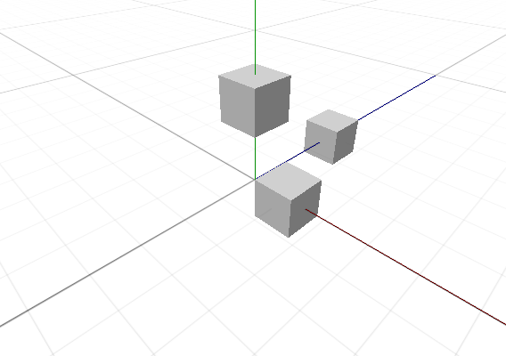
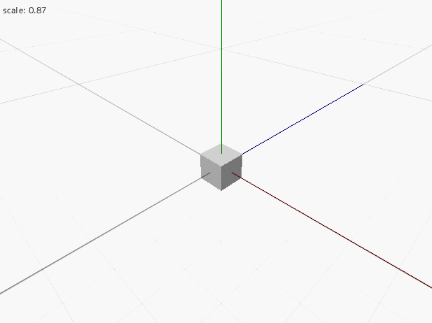

オブジェクトを動かす
==========


移動する
----------

既に前のチュートリアルで行ったように、座標を設定することでオブジェクトを移動できます。

# [C++](#tab/lang-cpp)
```cpp
#include <Lumino.hpp>

class App : public Application
{
    void onInit() override
    {
        Engine::renderView()->setGuideGridEnabled(true);
        Engine::camera()->setPosition(5, 5, -5);
        Engine::camera()->lookAt(0, 0, 0);

        auto box1 = BoxMesh::create();
        box1->setPosition(1, 0, 0);

        auto box2 = BoxMesh::create();
        box2->setPosition(0, 2, 0);

        auto box3 = BoxMesh::create();
        box3->setPosition(0, 0, 3);
    }
};

LUMINO_APP(App);
```
# [Ruby](#tab/lang-ruby)
```ruby
require 'lumino'

class App < Application
    def on_init
    end
end

App.new.run
```

---



回転する
----------

# [C++](#tab/lang-cpp)
```cpp
#include <Lumino.hpp>

class App : public Application
{
    Ref<BoxMesh> box;

    void onInit() override
    {
        Engine::renderView()->setGuideGridEnabled(true);
        Engine::camera()->setPosition(5, 5, -5);
        Engine::camera()->lookAt(0, 0, 0);

        box = BoxMesh::create();
    }

    void onUpdate() override
    {
        float r = Mouse::position().x / 100;

        box->setRotation(0, r, 0);
        
        Debug::printf(0, u"angle: {0}", r);
    }
};

LUMINO_APP(App);
```
# [Ruby](#tab/lang-ruby)
```ruby
require 'lumino'

class App < Application
    def on_init
    end
end

App.new.run
```

---


拡大・縮小する
----------

# [C++](#tab/lang-cpp)
```cpp
#include <Lumino.hpp>

class App : public Application
{
    Ref<BoxMesh> box;

    void onInit() override
    {
        Engine::renderView()->setGuideGridEnabled(true);
        Engine::camera()->setPosition(5, 5, -5);
        Engine::camera()->lookAt(0, 0, 0);

        box = BoxMesh::create();
    }

    void onUpdate() override
    {
        float s = Mouse::position().y / 100;

        box->setScale(s);
        
        Debug::printf(0, u"scale: {0}", s);
    }
};

LUMINO_APP(App);
```
# [Ruby](#tab/lang-ruby)
```ruby
require 'lumino'

class App < Application
    def on_init
    end
end

App.new.run
```

---




ワールドへの追加と除外
----------

TODO:

子オブジェクトの追加と除外
----------

TODO:

オブジェクトの破棄
----------

TODO:

