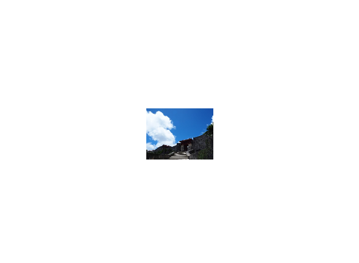
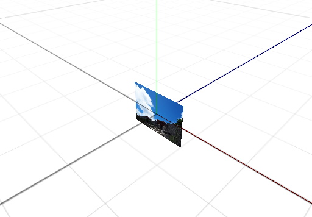
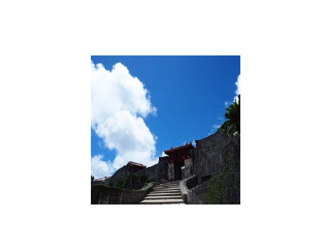

画像を描画する
==========

この章では、2D 画像を表す `テクスチャ` と、それを効率的にワールド上に表示する `スプライト` について学びます。

画像ファイルを読み込んで描画する
----------

画像を表示するには、まず `Texture2D` で画像ファイルを読み込み、次に `Sprite` オブジェクトを作成します。

Sprite は画像を張り付けて表示するための板のようなものであると考えてください。

ここでは次の画像を表示してみます。チュートリアル冒頭で作成したプロジェクトの `assets` フォルダの中に、次のような `picture1.jpg` というファイルが入っていることを確認して実行してください。


# [C++](#tab/lang-cpp)
```cpp
#include <Lumino.hpp>

class App : public Application
{
    void onInit() override
    {
        auto texture = Texture2D::load(u"picture1.jpg");
        auto sprite = Sprite::create(texture);
    }
};

LUMINO_APP(App);
```
# [Ruby](#tab/lang-ruby)
```ruby
require "lumino"

class App < Application
  def on_init
    texture = Texture2D.load("picture1.jpg")
    sprite = Sprite.new(texture)
  end
end

App.new.run
```

---



### 対応している画像フォーマット

現在、画像フォーマットの読み込みがサポートされています。

| フォーマット | 拡張子 | 対応状況 |
|---|---|---|
| PNG | png | ✔ |
| JPEG | jpg, jpeg | ✔ |
| BMP | bmp | ✔ |
| GIF | gif | ✔ (アニメーション非対応) |
| TGA | tga | ✔ |


サイズを変更する
----------

画像が表示されましたが、少し小さいように見えます。

`Sprite` はサイズを指定しない場合、画像のアスペクト比を保ったまま、`高さを 1` として描画を行います。

視点を変えると、次のように見えます。



次のプログラムは、スプライトの幅と高さを 3 にすることで、少し大きくかつ正方形に描画されるようにしています。

# [C++](#tab/lang-cpp)
```cpp
#include <Lumino.hpp>

class App : public Application
{
    void onInit() override
    {
        auto texture = Texture2D::load(u"picture1.jpg");
        auto sprite = Sprite::create(texture);
        sprite->setSize(3, 3);
    }
};

LUMINO_APP(App);
```
# [Ruby](#tab/lang-ruby)
```ruby
require "lumino"

class App < Application
  def on_init
    texture = Texture2D.load("picture1.jpg")
    sprite = Sprite.new(texture)
    sprite.set_size(3, 3)
  end
end

App.new.run
```
---



絵文字を描画する
----------

サンプルをカスタマイズしたりテストプログラムを描くときに、すぐに使える画像として絵文字を利用できます。

絵文字はテクスチャとして作成し、スプライトにセットすることで表示できます。

# [C++](#tab/lang-cpp)
```cpp
#include <Lumino.hpp>

class App : public Application
{
    void onInit() override
    {
        auto texture = Texture2D::loadEmoji(u"🌱");
        auto sprite = Sprite::create(texture);
    }
};

LUMINO_APP(App);
```
# [Ruby](#tab/lang-ruby)
```ruby
require "lumino"

class App < Application
  def on_init
    texture = Texture2D.load_emoji("🌱")
    sprite = Sprite.new(texture)
  end
end

App.new.run
```
---


### 絵文字の一覧

次のページから、プログラムにコピーして使えます。

- https://getemoji.com/

Lumino に組み込まれている絵文字は Android 10 版です。イメージは次のページから確認できます。

- https://emojipedia.org/google/

上下・左右を反転して描画する
----------

TODO:

テクスチャの一部を描画する
----------

TODO:
