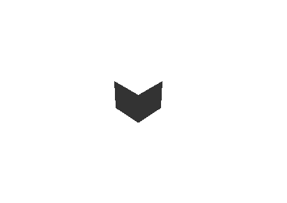

ライトを設定する
==========

この章では、ワールド内のオブジェクトに陰影をつけるためライティングについて学びます。

ライトの基本操作
----------

ライトを移動して、光の当たり方を変えてみます。

カメラと同じく、初期状態ではひとつのライトがワールドに配置されています。

このライトは、最も一般的に使用される `DirectionalLight` と呼ばれるものです。DirectionalLight は、太陽のように一定方向から均一に、ワールド全体を照らします。

次のコードで、カメラと同じように向きを変え、中天から直下を照らすようにしてみます。

# [C++](#tab/lang-cpp)
```cpp
#include <Lumino.hpp>

class App : public Application
{
    void onInit() override
    {
        auto box = BoxMesh::create();

        auto camera = Engine::camera();
        camera->setPosition(5, 5, -5);
        camera->lookAt(0, 0, 0);

        auto light = Engine::light();
        light->lookAt(0, -1, 0);
    }
};

LUMINO_APP(App);
```
# [Ruby](#tab/lang-ruby)
```ruby
require 'lumino'

class App < Application
    def on_init
        box = BoxMesh.new

        camera = Engine.camera
        camera.set_position(5, 5, -5)
        camera.lookAt(0, 0, 0)

        light = DirectionalLight.new;
    end
end

App.new.run
```
---



ボックスが真上から照らされるようになるため、上面が明るくなり、他の面は暗くなりました。


ライトの種類
----------

TODO:

### DirectionalLight

### AmbientLight

### PointLight

### SpotLight
