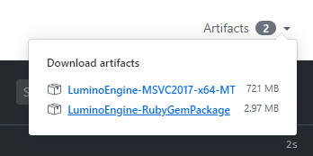

ダウンロード
====================

パッケージは開発環境ごとに用意されており、各ターゲットプラットフォーム向けのビルドに必要なファイルが含まれています。

Windows パッケージには次のターゲットをビルドするためのファイルが含まれています。
- Win32
- Web
- Android

macOS パッケージには次のターゲットをビルドするためのファイルが含まれています。
- macOS
- iOS

最新リリース
--------

### 0.8.0

<a href="http://nnmy.sakura.ne.jp/archive/lumino/v0.8.0/Lumino-0.8.0-Windows.msi" class="button">
  <i class="glyphicon glyphicon-download"></i>Windows (Installer)
</a>

<a href="http://nnmy.sakura.ne.jp/archive/lumino/v0.8.0/Lumino-0.8.0-Windows.zip" class="button">
  <i class="glyphicon glyphicon-download"></i>Windows (ZIP archive)
</a>

<a href="http://nnmy.sakura.ne.jp/archive/lumino/v0.8.0/Lumino-0.8.0-macOS.zip" class="button">
  <i class="glyphicon glyphicon-download"></i>macOS (ZIP archive)
</a>

現在開発中の最新ビルド
--------

リポジトリの GitHub Actions に紐づけられている Artifacts よりダウンロードできます。

[リポジトリのページ](https://github.com/lriki/Lumino)を開き、✔ マーク > Details > Artifacts から選択してください。

古いリリース
--------

### v0.7.0

<a href="http://nnmy.sakura.ne.jp/archive/lumino/0.7.0/Lumino-0.7.0-Windows.msi" class="button">
  <i class="glyphicon glyphicon-download"></i>Windows (Installer)
</a>

<a href="http://nnmy.sakura.ne.jp/archive/lumino/0.7.0/Lumino-0.7.0-Windows.zip" class="button">
  <i class="glyphicon glyphicon-download"></i>Windows (ZIP archive)
</a>

<a href="http://nnmy.sakura.ne.jp/archive/lumino/0.7.0/Lumino-0.7.0-macOS.zip" class="button">
  <i class="glyphicon glyphicon-download"></i>macOS (ZIP archive)
</a>

### v0.6.0

<a href="http://nnmy.sakura.ne.jp/archive/lumino/0.6.0/Lumino-0.6.0-Windows.msi" class="button">
  <i class="glyphicon glyphicon-download"></i>Windows (Installer)
</a>

<a href="http://nnmy.sakura.ne.jp/archive/lumino/0.6.0/Lumino-0.6.0-Windows.zip" class="button">
  <i class="glyphicon glyphicon-download"></i>Windows (ZIP archive)
</a>

<a href="http://nnmy.sakura.ne.jp/archive/lumino/0.6.0/Lumino-0.6.0-macOS.zip" class="button">
  <i class="glyphicon glyphicon-download"></i>macOS (ZIP archive)
</a>
