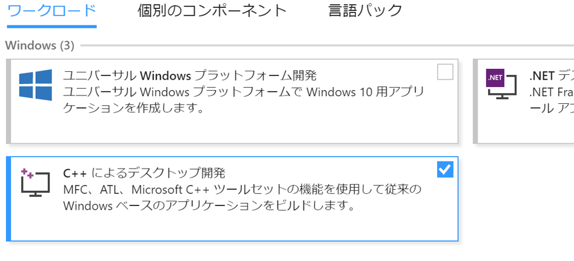

C++ で Lumino をはじめる
==========

開発環境の準備を行う (Windows の場合)
--------

### Visual Studio をインストールする

1. [Visual Studio の Web ページ](https://visualstudio.microsoft.com/ja/downloads/) から Visual Studio 2019 Community をダウンロードし、インストールしてください。
2. Visual Studio インストーラーを実行して C++ 開発ツール（C++ によるデスクトップ開発）をインストールします。



### Lumino をインストールする

1. [Lumino のダウンロードページ](./download.md) からインストーラをダウンロードし、実行してください。インストーラの指示に従ってインストールを行います。
2. 実行時に Windows SmartScreen の注意メッセージが表示された場合は「詳細情報」→「実行」を押してください。


開発環境の準備を行う (macOS の場合)
--------

1. [Lumino のダウンロードページ](download.md) から macOS 用パッケージの .zip ファイルをダウンロードして展開してください。
2. パッケージのルートにある `setup.sh` を実行してください。Lumino のツールに PATH が通るようになります。


プロジェクトを作成する
--------
ターミナル（コマンドプロンプト）を開いて次のコマンドを入力します。

```sh
lumino init hello
```

カレントディレクトリの下に hello というディレクトリが作成され、その中に必要なファイルが作成されます。

続いて作成されたディレクトリに移動しておきます。

```sh
cd hello
```

プロジェクトを実行する
--------
Lumino のプロジェクトディレクトリ(.lnproj ファイルのあるディレクトリ)で次のコマンドを入力します。

```sh
lumino run
```

動作中のプラットフォーム向けのアプリがビルド・実行され、ウィンドウが表示されます。

その他のプラットフォーム固有の情報は以下のページを参照してください。
- [Windows アプリ](../platform-specific/windows.md)
- [macOS アプリ](../platform-specific/macos.md)
- [iOS アプリ](../platform-specific/ios.md)
- [Android アプリ](../platform-specific/android.md)
- [Web アプリ](../platform-specific/web.md)


