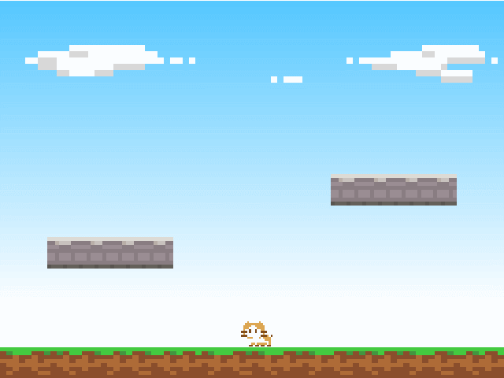

アニメーション
==========

プレイヤーは移動できるようになりましたが、まだアニメーションが実装されていないため、地面を滑るようにしか移動できません。

ここでは、以前に作成したスプライトフレームを切り替えて表示する画像を変化させる、パターンアニメーションを実装します。


実装する動作
----------
以前、スプライトフレームは次のように分割しました。


これらは次のような動作に対応します。

| フレーム  |  動作  |
| ---  | --- |
| 0  | 待機 |
| 2, 3  | 歩行 |
| 4 | ジャンプ |
| 5 | 下降 |


歩行と待機
----------

まずはどのアニメーションを表示すればよいか、現在の状態を判断する必要があります。
今回は、歩行中と待機中のどちらであるかは X 方向の速度によって決めることにします。

```cpp
if (onGround) {
    if (velocity.x < 0.0) {
        // 左へ移動中
        playerSprite->setFrameIndex(2 + std::fmod(Engine::totalTime(), 0.4) / 0.2);
        playerSprite->setFlippedX(false);
    }
    else if (velocity.x > 0.0) {
        // 右へ移動中
        playerSprite->setFrameIndex(2 + std::fmod(Engine::totalTime(), 0.4) / 0.2);
        playerSprite->setFlippedX(true);
    }
    else {
        // 待機中
        playerSprite->setFrameIndex(0);
    }
}
```



### 経過時間と FrameIndex の計算

`Engine::totalTime()` は、ゲーム起動からの経過時間を秒単位の小数値で返します。これを利用して、0.2 秒間隔で FrameIndex を 2, 3 交互に切り替えて歩行アニメーションを表現します。

※ std::fmod は小数の剰余算を行う、C++ 標準ライブラリの関数です。


### 左右反転

スプライトは `setFlippedX()` によって、表示するテクスチャを左右反転することができます。

今回は見た目上の反転だけで充分であるため、このメソッドを使用しています。

> 左右反転は他に、setScale() というメソッドを使用して X 方向の拡大率を -1.0 にする、という方法があります。
> 今回のチュートリアルでは触れませんが、これは例えばキャラクターと武器のスプライトが分かれていて、これらが親子関係でリンクされている場合に有効です。


ジャンプと下降
----------

ジャンプと下降の状態判断は、Y 方向の速度によって決めます。
また、これらは空中にいる場合のみ適用するべきですので、先ほどの「歩行と待機」で追加した "if (onGround)" の else 側にコードを追加します。

```cpp
if (onGround) {
    // ... 歩行と待機のアニメーション処理
}
else {
    if (velocity.y > 0.0) {
        // 上昇中
        playerSprite->setFrameIndex(4);
    }
    else {
        // 下降中
        playerSprite->setFrameIndex(5);
    }
}
```


今回は空中では時間経過によるアニメーションは用意されていないため、FrameIndex を切り替えるだけです。


コード全体
----------

```cpp
#include <Lumino.hpp>

static const uint32_t GroundGroup = 0x01;   // 地面の衝突グループ
static const uint32_t PlayerGroup = 0x02;   // プレイヤーの衝突グループ

void Main()
{
    // ワールドの 16x12 の範囲を表示する
    Camera* camera = Engine::mainCamera();
    camera->setProjectionMode(ProjectionMode::Orthographic);
    camera->setOrthographicSize(16, 12);

    // 空
    Ref<Texture> skyTexture = Assets::loadTexture(u"sky");
    Ref<Sprite> skySprite = Sprite::create(skyTexture, 16, 12);

    // 地面
    Ref<Texture> mapTexture = Assets::loadTexture(u"map");
    Ref<Sprite> groundSprite = Sprite::create(mapTexture, 16, 1);
    groundSprite->setSourceRect(0, 0, 80, 8);
    groundSprite->setPosition(0, -5.5, 0);

    // 地面の剛体
    Ref<RigidBody2DComponent> groundBody = RigidBody2DComponent::create();
    groundBody->addCollisionShape(BoxCollisionShape2D::create(16, 1));
    groundBody->setCollisionGroup(GroundGroup);
    groundSprite->addComponent(groundBody);

    // 左の床
    Ref<Sprite> floorSprite1 = Sprite::create(mapTexture, 4, 1);
    floorSprite1->setSourceRect(0, 8, 32, 8);
    floorSprite1->setPosition(-4.5, -2, 0);

    // 左の床の剛体
    Ref<RigidBody2DComponent> floorBody1 = RigidBody2DComponent::create();
    floorBody1->addCollisionShape(BoxCollisionShape2D::create(4, 1));
    floorBody1->setCollisionGroup(GroundGroup);
    floorSprite1->addComponent(floorBody1);

    // 右の床
    Ref<Sprite> floorSprite2 = Sprite::create(mapTexture, 4, 1);
    floorSprite2->setSourceRect(0, 8, 32, 8);
    floorSprite2->setPosition(4.5, 0, 0);

    // 右の床の剛体
    Ref<RigidBody2DComponent> floorBody2 = RigidBody2DComponent::create();
    floorBody2->addCollisionShape(BoxCollisionShape2D::create(4, 1));
    floorBody2->setCollisionGroup(GroundGroup);
    floorSprite2->addComponent(floorBody2);

    // プレイヤー
    Ref<Texture> playerTexture = Assets::loadTexture(u"player");
    Ref<SpriteFrameSet> frameSet = SpriteFrameSet::create(playerTexture, 16, 16);
    Ref<Sprite> playerSprite = Sprite::create(frameSet);
    playerSprite->setFrameIndex(0);

    // プレイヤーの剛体
    Ref<RigidBody2DComponent> playerBody = RigidBody2DComponent::create();
    playerBody->addCollisionShape(BoxCollisionShape2D::create(1, 1));
    playerBody->setMass(2);
    playerBody->setFixedRotation(true);
    playerBody->setCollisionGroup(PlayerGroup);
    playerSprite->addComponent(playerBody);

    // 画面外への移動を制限するための剛体
    Ref<EdgeCollisionShape2D> wallShape = EdgeCollisionShape2D::create();
    wallShape->addPoint(-8, -6);
    wallShape->addPoint(8, -6);
    wallShape->addPoint(8, 6);
    wallShape->addPoint(-8, 6);
    Ref<RigidBody2DComponent> wallBody = RigidBody2DComponent::create();
    wallBody->addCollisionShape(wallShape);
    skySprite->addComponent(wallBody);

    // メインループ
    while (Engine::update())
    {
        Vector2 velocity = playerBody->velocity();

        // プレイヤーの移動処理
        if (Input::isPressed(u"right")) {
            velocity.x = 5.0f;
        }
        else if (Input::isPressed(u"left")) {
            velocity.x = -5.0f;
        }
        else {
            velocity.x = 0.0f;
        }

        // プレイヤーのジャンプ処理
        bool onGround = Physics2D::raycast(playerSprite->position(), -Vector2::UnitY, 0.6, GroundGroup);
        if (onGround) {
            if (Input::isPressed(u"submit")) {
                velocity.y = 10.0;
            }
        }

        // プレイヤーのアニメーション処理
        if (onGround) {
            if (velocity.x < 0.0) {
                // 左へ移動中
                playerSprite->setFrameIndex(2 + std::fmod(Engine::totalTime(), 0.4) / 0.2);
                playerSprite->setFlippedX(false);
            }
            else if (velocity.x > 0.0) {
                // 右へ移動中
                playerSprite->setFrameIndex(2 + std::fmod(Engine::totalTime(), 0.4) / 0.2);
                playerSprite->setFlippedX(true);
            }
            else {
                // 待機中
                playerSprite->setFrameIndex(0);
            }
        }
        else {
            if (velocity.y > 0.0) {
                // 上昇中
                playerSprite->setFrameIndex(4);
            }
            else {
                // 下降中
                playerSprite->setFrameIndex(5);
            }
        }

        playerBody->setVelocity(velocity);
    }
}
```

