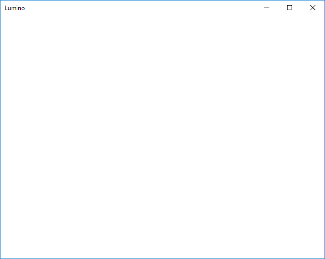

Lumino の基本
==========

プロジェクトを作成する
----------

TODO:

```
lumino-cli init LuminoTutorial -t SimpleDesktop
```


ウィンドウを表示するだけの最小限のプログラム
----------

プロジェクトを作成したら、プロジェクトフォルダの中にある .sln ファイルを Visual Studio で開いてください。

Main.cpp を開くと、次のようなプログラムが表示されます。

```cpp
#include <Lumino.hpp>

void Main()
{
    while (Engine::update())
    {

    }
}
```

実行すると、次のようなウィンドウが表示されます。



`while (Engine::update())` のループは、ウィンドウが閉じられるまでの間、1秒間に60回の周期で実行され続けます。
Engine::update() はウインドウが閉じられていなければ true を返し、ウインドウ右上の×ボタンを押すなどで閉じられた場合は false を返します。

このループ1回のことを「フレーム」と呼び、この中に

- プレイヤーの入力を確認し、
- キャラクターを移動し、
- ウィンドウに絵を描く

といったプログラムを書くことでゲームを進行させます。
