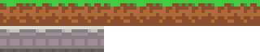
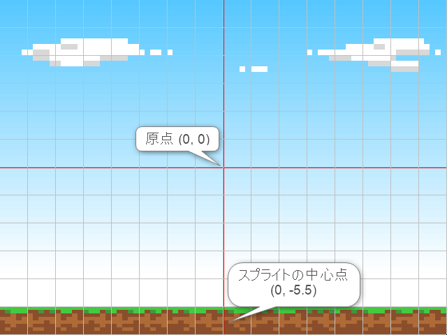

ワールドの構築
==========

スプライトをはじめとした様々なオブジェクトを配置し、ゲームの舞台を作り上げるためのスペースのことを `ワールド` と呼びます。

ここではワールドに複数のスプライトを配置し、ゲームのマップを作っていきます。

なお、このページからは説明文中ではコードの断片を説明していきます。全体のコードはページ末尾にありますので、必要に応じて参照してください。


16x12 の範囲をぴったりウィンドウに収める
----------

まず最初に座標を正確にとらえるようにするため、ウィンドウの四辺がちょうどワールドの幅16、高さ12の範囲を表示するようします。

Main の先頭に次のコードを追加し、実行します。

```
Camera* camera = Engine::mainCamera();
camera->setProjectionMode(ProjectionMode::Orthographic);
camera->setOrthographicSize(16, 12);
```


あまり変化があるようには見えませんが、前回の結果と比べてわずかな見切れが解決され、元の画像全体が正確に表示されるようになりました。


### Camera について

このチュートリアルではここでしか登場しませんが、Camera について簡単に触れておきます。

Lumino は 3D をベースとしたゲームエンジンであり、3D 空間をウィンドウに表示するための「視点」の概念として `カメラ` があります。

カメラはデフォルトでは奥行きのある投影を行いますが、このためウィンドウの四辺とワールド空間内の位置をマッチさせることが簡単ではありません。

このチュートリアルでは 2D ゲームとして座標を正確にとらえたいため、`setProjectionMode(ProjectionMode::Orthographic)` で奥行き感を無くし、`setOrthographicSize(16, 12)` で 16 x 12 の範囲を表示するようにしています。


地面を作る
----------

メインループの上に次のコードを追加し、実行します。

```cpp
Ref<Texture> mapTexture = Assets::loadTexture(u"map");

Ref<Sprite> groundSprite = Sprite::create(mapTexture, 16, 1);
groundSprite->setSourceRect(0, 0, 80, 8);
groundSprite->setPosition(0, -5.5);
```


setSourceRect と setPosition という新しいメソッドが登場しました。


### setSourceRect について

このメソッドはスプライトに対して、テクスチャのどの部分を表示するべきかを示す領域を設定します。

mapTexture に読み込んだテクスチャは次のようになっています。



`setSourceRect(0, 0, 80, 8)` は次のように、矩形の左上座標と幅、高さをピクセル単位で指定します。


これによって、テクスチャの一部分を切り出して描画することができます。


### setPosition と座標系について

このメソッドはオブジェクトをどの位置に表示するべきかを設定します。

Lumino の座標系は次のように、右方向を X+、上方向を Y+ としています。



今回のシーンでは、Y 座標を -5.5 とすることで、スクリーンの下端にスプライトを配置しています。

スプライトの原点は画像の中心となっているため、次のように表示されます。


床を作る
----------

キャラクターがジャンプで乗ることができる床のイメージを追加します。

テクスチャは地面のテクスチャ (mapTexture) と共有し、setSourceRect で範囲を指定することで床のイメージを表示します。

```cpp
Ref<Sprite> floorSprite1 = Sprite::create(mapTexture, 4, 1);
floorSprite1->setSourceRect(0, 8, 32, 8);
floorSprite1->setPosition(-5, -2, 0);

Ref<Sprite> floorSprite2 = Sprite::create(mapTexture, 4, 1);
floorSprite2->setSourceRect(0, 8, 32, 8);
floorSprite2->setPosition(5, 0, 0);
```


コード全体
----------

```cpp
#include <Lumino.hpp>

void Main()
{
    // ワールドの 16x12 の範囲を表示する
    Camera* camera = Engine::mainCamera();
    camera->setProjectionMode(ProjectionMode::Orthographic);
    camera->setOrthographicSize(16, 12);

    // 空
    Ref<Texture> skyTexture = Assets::loadTexture(u"sky");
    Ref<Sprite> skySprite = Sprite::create(skyTexture, 16, 12);

    // 地面
    Ref<Texture> mapTexture = Assets::loadTexture(u"map");
    Ref<Sprite> groundSprite = Sprite::create(mapTexture, 16, 1);
    groundSprite->setSourceRect(0, 0, 80, 8);
    groundSprite->setPosition(0, -5.5, 0);

    // 左の床
    Ref<Sprite> floorSprite1 = Sprite::create(mapTexture, 4, 1);
    floorSprite1->setSourceRect(0, 8, 32, 8);
    floorSprite1->setPosition(-5, -2, 0);

    // 右の床
    Ref<Sprite> floorSprite2 = Sprite::create(mapTexture, 4, 1);
    floorSprite2->setSourceRect(0, 8, 32, 8);
    floorSprite2->setPosition(5, 0, 0);

    // メインループ
    while (Engine::update())
    {
    }
}
```
