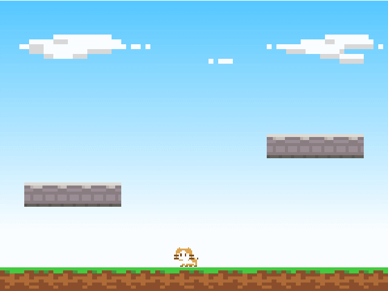
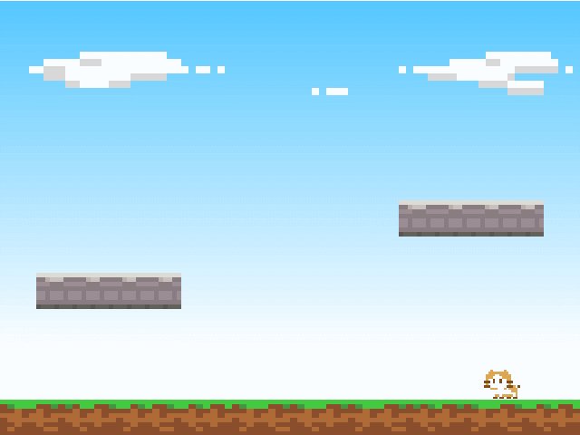

移動とジャンプ
==========

物理ワールドを構築しましたので、次はプレイヤーの各アクションを実装していきます。


プレイヤーを移動させる
----------



移動は、剛体の速度をコントロールすることで行います。速度をコントロールする方法はいくつかありますが、ここでは直接速度を設定します。

```cpp
// メインループ
while (Engine::update())
{
    Vector2 velocity = playerBody->velocity();

    if (Input::isPressed(u"right")) {
        velocity.x = 5.0f;
    }
    else if (Input::isPressed(u"left")) {
        velocity.x = -5.0f;
    }
    else {
        velocity.x = 0.0f;
    }

    playerBody->setVelocity(velocity);
}
```

### 速度とベクトル

速度は X 方向と Y 方向の 2 次元のベクトルで表されます。

Lumino では 2 次元のベクトルを扱うために `Vector2` を使います。（同様に、3次元や4次元を表す Vector3 や Vector4 もあります）

今回のコードは、左右のキーが押されている間は X 方向の速度を直接 5.0 に変更することでプレイヤーを移動しています。（Y 方向の速度は、物理演算によって求められた落下速度などをそのまま使用します）

なお、速度 5.0 は 1 秒間に 5.0 分の座標を移動することを示します。


### setPosition による移動と setVelocity による移動の違い

setPosition はプレイヤーの位置を直接指定します。実際の振る舞いとしてはワープしているようになります。
そのため、プレイヤーがとても速く移動している場合、壁などの剛体をすり抜けてしまうことがあります。

一方 setVelocity はプレイヤーの速度だけを指定して、実際にどの位置に移動するべきかは物理演算に任せます。
これによってすり抜けなどの問題を回避でき、より正確な動きができるようになります。


衝突グループを設定する
----------

次にジャンプを実装していきますが、その前にこれまでに用意してきた剛体をグループ分けします。
これにより、ジャンプの処理で必要となる「地面の上に載っているか？」といった確認を簡単に行えるようになります。

```cpp
static const uint32_t GroundGroup = 0x01;   // 地面の衝突グループ
static const uint32_t PlayerGroup = 0x02;   // プレイヤーの衝突グループ
```

```diff
  // 地面の剛体
  Ref<RigidBody2DComponent> groundBody = RigidBody2DComponent::create();
  groundBody->addCollisionShape(BoxCollisionShape2D::create(16, 1));
+ groundBody->setCollisionGroup(GroundGroup);
  groundSprite->addComponent(groundBody);
```

```diff
  // 左の床の剛体
  Ref<RigidBody2DComponent> floorBody1 = RigidBody2DComponent::create();
  floorBody1->addCollisionShape(BoxCollisionShape2D::create(4, 1));
+ floorBody1->setCollisionGroup(GroundGroup);
  floorSprite1->addComponent(floorBody1);
```

```diff
  // 右の床の剛体
  Ref<RigidBody2DComponent> floorBody2 = RigidBody2DComponent::create();
  floorBody2->addCollisionShape(BoxCollisionShape2D::create(4, 1));
+ floorBody2->setCollisionGroup(GroundGroup);
  floorSprite2->addComponent(floorBody2);
```

```diff
  // プレイヤーの剛体
  Ref<RigidBody2DComponent> playerBody = RigidBody2DComponent::create();
  playerBody->addCollisionShape(BoxCollisionShape2D::create(1, 1));
  playerBody->setMass(2);
  playerBody->setFixedRotation(true);
+ playerBody->setCollisionGroup(PlayerGroup);
  playerSprite->addComponent(playerBody);
```

グループはビットフラグで指定します。今回は、1 番目のビットを地面、2 番目のビットをプレイヤーとしています。


プレイヤーをジャンプさせる
----------



プレイヤーが地面の上にいるときにキーが押された場合、ジャンプするようにします。

```cpp
bool onGround = Physics2D::raycast(playerSprite->position(), Vector2(0, -1), 0.6, GroundGroup);
if (onGround) {
    if (Input::isPressed(u"submit")) {
        velocity.y = 10.0;
    }
}
```

※ "submit" については [プレイヤーの表示](4-player.md) を参照してください。

### 地面との接触判定

プレイヤーが地面に乗っているかどうかは、プレイヤーの位置から下方向に延びる線分と、地面の剛体との交差判定で求めます。

この線分を `レイ` と呼び、これを使って交差するオブジェクトを検出することを `レイキャスト` と呼びます。

`Physics2D::raycast` の引数はそれぞれ次のような意味を持ちます。
- プレイヤーの位置から、
- 下方向 (Vector2::UnitY は 上方向(0, 1) を表す定数で、これをマイナスすることで下方向を表します) へ、
- 長さ 0.6 のレイを使って、
- 衝突グループが GroundGroup (地面) である剛体との交差判定を行う。

長さ 0.6 は少しイメージしづらいかもしれませんが、次の図のように、プレイヤーのスプライトから少しだけ突き出すようなレイを生成するための値です。


左は地面と接触している場合、右は接触していない場合の例です。


画面外への移動を制限する
----------

移動処理の仕上げとして、画面の外側に移動できないようにします。

```cpp
Ref<EdgeCollisionShape2D> wallShape = EdgeCollisionShape2D::create();
wallShape->addPoint(-8, 6);    // 左上
wallShape->addPoint(8, 6);     // 右上
wallShape->addPoint(8, -6);    // 右下
wallShape->addPoint(-8, -6);   // 左下
Ref<RigidBody2DComponent> wallBody = RigidBody2DComponent::create();
wallBody->addCollisionShape(wallShape);
skySprite->addComponent(wallBody);
```

### エッジ衝突判定形状

EdgeCollisionShape2D はちょうど壁のような、剛体が通過できない線分を生成するためのクラスです。

addPoint() によって点を追加することで、各点を結ぶ連続した線分からなる、大きな壁を作ることができます。

ここでは画面全体を囲むように、左上 → 右上 → 右下 → 左下 の順で点を追加しています。


また、ちょうど背景のスプライトが同じサイズであったため、新しいオブジェクトを作成するのではなく、skySprite へ静的な剛体をアタッチしています。


コード全体
----------

```cpp
#include <Lumino.hpp>

static const uint32_t GroundGroup = 0x01;   // 地面の衝突グループ
static const uint32_t PlayerGroup = 0x02;   // プレイヤーの衝突グループ

void Main()
{
    // ワールドの 16x12 の範囲を表示する
    Camera* camera = Engine::mainCamera();
    camera->setProjectionMode(ProjectionMode::Orthographic);
    camera->setOrthographicSize(16, 12);

    // 空
    Ref<Texture> skyTexture = Assets::loadTexture(u"sky");
    Ref<Sprite> skySprite = Sprite::create(skyTexture, 16, 12);

    // 地面
    Ref<Texture> mapTexture = Assets::loadTexture(u"map");
    Ref<Sprite> groundSprite = Sprite::create(mapTexture, 16, 1);
    groundSprite->setSourceRect(0, 0, 80, 8);
    groundSprite->setPosition(0, -5.5, 0);

    // 地面の剛体
    Ref<RigidBody2DComponent> groundBody = RigidBody2DComponent::create();
    groundBody->addCollisionShape(BoxCollisionShape2D::create(16, 1));
    groundBody->setCollisionGroup(GroundGroup);
    groundSprite->addComponent(groundBody);

    // 左の床
    Ref<Sprite> floorSprite1 = Sprite::create(mapTexture, 4, 1);
    floorSprite1->setSourceRect(0, 8, 32, 8);
    floorSprite1->setPosition(-4.5, -2, 0);

    // 左の床の剛体
    Ref<RigidBody2DComponent> floorBody1 = RigidBody2DComponent::create();
    floorBody1->addCollisionShape(BoxCollisionShape2D::create(4, 1));
    floorBody1->setCollisionGroup(GroundGroup);
    floorSprite1->addComponent(floorBody1);

    // 右の床
    Ref<Sprite> floorSprite2 = Sprite::create(mapTexture, 4, 1);
    floorSprite2->setSourceRect(0, 8, 32, 8);
    floorSprite2->setPosition(4.5, 0, 0);

    // 右の床の剛体
    Ref<RigidBody2DComponent> floorBody2 = RigidBody2DComponent::create();
    floorBody2->addCollisionShape(BoxCollisionShape2D::create(4, 1));
    floorBody2->setCollisionGroup(GroundGroup);
    floorSprite2->addComponent(floorBody2);

    // プレイヤー
    Ref<Texture> playerTexture = Assets::loadTexture(u"player");
    Ref<SpriteFrameSet> frameSet = SpriteFrameSet::create(playerTexture, 16, 16);
    Ref<Sprite> playerSprite = Sprite::create(frameSet);
    playerSprite->setFrameIndex(0);

    // プレイヤーの剛体
    Ref<RigidBody2DComponent> playerBody = RigidBody2DComponent::create();
    playerBody->addCollisionShape(BoxCollisionShape2D::create(1, 1));
    playerBody->setMass(2);
    playerBody->setFixedRotation(true);
    playerBody->setCollisionGroup(GroundGroup);
    playerSprite->addComponent(playerBody);

    // 画面外への移動を制限するための剛体
    Ref<EdgeCollisionShape2D> wallShape = EdgeCollisionShape2D::create();
    wallShape->addPoint(-8, -6);
    wallShape->addPoint(8, -6);
    wallShape->addPoint(8, 6);
    wallShape->addPoint(-8, 6);
    Ref<RigidBody2DComponent> wallBody = RigidBody2DComponent::create();
    wallBody->addCollisionShape(wallShape);
    skySprite->addComponent(wallBody);

    // メインループ
    while (Engine::update())
    {
        Vector2 velocity = playerBody->velocity();

        // プレイヤーの移動処理
        if (Input::isPressed(u"right")) {
            velocity.x = 5.0f;
        }
        else if (Input::isPressed(u"left")) {
            velocity.x = -5.0f;
        }
        else {
            velocity.x = 0.0f;
        }

        // プレイヤーのジャンプ処理
        bool onGround = Physics2D::raycast(playerSprite->position(), -Vector2::UnitY, 0.6, GroundGroup);
        if (onGround) {
            if (Input::isPressed(u"submit")) {
                velocity.y = 10.0;
            }
        }

        playerBody->setVelocity(velocity);
    }
}
```

