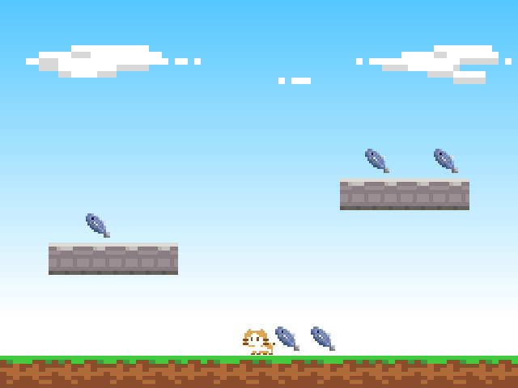
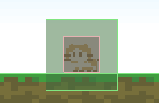

アイテムを集める
==========

操作しているキャラクターが別のオブジェクトと接触したら何らかのイベントを発生させるようなインタラクションは、アクションゲームの基本的なシステムのひとつです。

ここではマップ内にアイテム（魚）をばらまいて、プレイヤーをそれを集めるような仕組みを実装します。


アイテムを生成する
----------

```
Ref<Texture> itemTexture = Assets::loadTexture(u"item");
for (int i = 0; i < 5; i++) {
    Ref<Sprite> itemSprite = Sprite::create(itemTexture, 1, 1);
    Ref<RigidBody2DComponent> itemBody = RigidBody2DComponent::create();
    itemBody->addCollisionShape(BoxCollisionShape2D::create(1, 1));
    itemBody->setMass(0.5);
    itemBody->setFixedRotation(true);
    itemBody->setCollisionGroupMask(GroundGroup);
    itemSprite->addComponent(itemBody);
    itemSprite->setPosition(Random::randFloat(-7, 7), 4);
}
```




衝突検知のための準備をする
----------

```
static const uint32_t ItemGroup = 0x04;     // アイテムの衝突グループ
```

```diff
 Ref<Texture> itemTexture = Assets::loadTexture(u"item");
 for (int i = 0; i < 5; i++) {
     Ref<Sprite> itemSprite = Sprite::create(itemTexture, 1, 1);
     Ref<RigidBody2DComponent> itemBody = RigidBody2DComponent::create();
     itemBody->addCollisionShape(BoxCollisionShape2D::create(1, 1));
     itemBody->setMass(0.5);
     itemBody->setFixedRotation(true);
+    itemBody->setCollisionGroup(ItemGroup);
     itemBody->setCollisionGroupMask(GroundGroup);
     itemSprite->addComponent(itemBody);
     itemSprite->setPosition(Random::randFloat(-7, 7), 4);
 }
```

```
Ref<TriggerBody2DComponent> triggerBody = TriggerBody2DComponent::create();
triggerBody->addCollisionShape(BoxCollisionShape2D::create(2, 2));
triggerBody->setCollisionGroupMask(ItemGroup);
playerSprite->addComponent(triggerBody);
```

```
Engine::mainRenderView()->setPhysicsDebugDrawEnabled(true);
```




プレイヤーと接触したアイテムを削除する
----------

```diff
  Ref<TriggerBody2DComponent> triggerBody = TriggerBody2DComponent::create();
  triggerBody->addCollisionShape(BoxCollisionShape2D::create(2, 2));
  triggerBody->setCollisionGroupMask(ItemGroup);
  playerSprite->addComponent(triggerBody);
+ triggerBody->connectOnCollisionEnter([&](Collision* collision)
+ {
+     collision->worldObject()->destroy();
+ });
```


