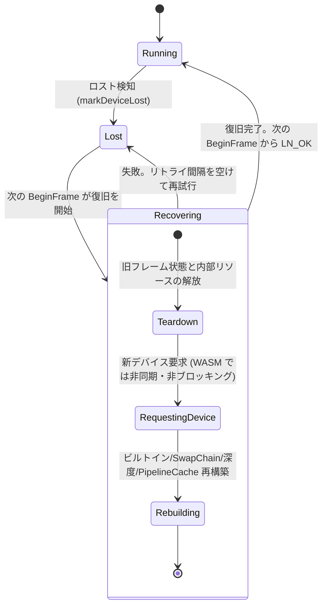

# デバイスロスト対応 設計ドキュメント (改善案 #26 / フェーズA)

- ステータス: 実装済み (フェーズ B1-B3 完了)
- 作成日: 2026-07-17
- 改訂履歴:
  - 改訂1: 初版 (クライアントが LNInstance_RecoverDevice を明示的に呼ぶ方式)
  - 改訂2: レビューフィードバックにより「クライアントは何も呼ばず、LuminoCore が
    裏で自動復旧する」方式へ変更。あわせて C++ 側のソースデータ保持状況の
    調査結果を反映
  - 改訂3: フェーズB 実装完了を反映。実装で確定した詳細は「実装メモ」参照
- 関連資料:
  - `docs/architecture-review-2026-07.md` 改善案 #26
  - `AGENTS.md` "コアモジュールのメモリ使用の注意点" (再アップロード用データは JS 側管理を推奨)

## 実装メモ (フェーズB 完了時点)

- 検知: `rhi::Device::isDeviceLost / markDeviceLost` (Rhi.hpp)。Vulkan は
  `VulkanDevice::checkDeviceLost` を全キュー操作に配線。WebGPU はロスト
  コールバック + acquire status (Lost / Error) を分類
- 伝搬: `LN_ERROR_DEVICE_LOST = -6`。GPU 依存の C API 28 関数の入口に
  `isDeviceLostNow()` ガード。`LN_MAKE_ERROR_WITH_CODE` で ErrorCode 付き
  エラーを生成し `toLNResult` でマップ
- 自動復旧: `GraphicsModule::pumpRecovery()` を `LNGraphicsContext_BeginFrame`
  がポンプする。デバイス作成は `rhi::Device::beginCreateAsync / pumpAsyncInit`
  (Web は WebGPUDevice のステップ実行初期化、デスクトップは同期作成に委譲)
- stale 判定: `ln::Object::deviceGeneration` と `GraphicsModule::deviceGeneration`
  の比較。描画系はスキップ (LN_OK + 一度だけ警告)、レンダーパスのアタッチメントは
  LN_ERROR_INVALID_HANDLE のハードエラー
- luminojs: `beginFrame(): FrameInfo | null`、`ResidencyManager.invalidateAll()`、
  RT/DS の生成情報保持 + 自動再作成、`GraphicsContext.onDeviceRestored` フック
- テスト: gtest `Test_DeviceLost.SimulateThenAutoRecover` (Vulkan 実復旧)、
  vitest `DeviceLost.test.ts` (JS 層の復旧フロー)、playwright smoke
  (実ブラウザで deep シミュレーション -> 自動復旧 -> 描画再開)
- 実装中に発見・修正した既存バグ: `wrapObjectFromGet` が毎フレーム新規スロットを
  確保しレジストリを枯渇させる問題 (wrapOrRegisterObject を使用するよう修正)、
  `ObjectRegistry::wrapOrRegisterObject` の自己デッドロック

## 1. 背景と目標

GPU デバイスロスト (ブラウザのタブ復帰、GPU ドライバ更新、OS の GPU リセット、
コンシューマ機のサスペンド/レジューム) が発生すると、現状の Lumino は復旧手段を持たず
アプリケーションが全損する。長時間動作するエディタ (LYRIDRA) の堅牢性のため、
検知 - 伝搬 - 復旧のプロトコルを定義する。

### 目標: クライアントコードの形

復旧のためにクライアントが特別な API を呼ぶ必要はない。クライアントのフレームループは
次の形で完結する:

```c
void Render() {
    LNResult r = LNGraphicsContext_BeginFrame(...);
    if (r == LN_OK) {
        // ...描画処理...
        LNGraphicsContext_EndFrame(...);
    }
    else if (r == LN_ERROR_DEVICE_LOST) {
        // デバイスロスト検出・復旧待ち中。なにもしない
    }
    else {
        // その他のエラー
    }
}
```

- デバイスロスト中および復旧処理中、`BeginFrame` は `LN_ERROR_DEVICE_LOST` を返す
- 復旧処理は LuminoCore 内部で自動的に進行する (BeginFrame の呼び出しが復旧
  ステートマシンを 1 ステップずつ進める)
- 復旧が完了すると `BeginFrame` は再び `LN_OK` を返し、描画が再開できる
- luminojs クライアントでは、リソースの再アップロードも luminojs ランタイムが
  自動で行う。アプリコードは「beginFrame が null を返したらフレームをスキップ」のみ

### 受け入れる制約 (レビューで合意済み)

- RenderTarget / DepthStencil は復旧後に内容がリセットされる
- 未解放ハンドルのゾンビ化 (stale 化) を許容する
- Texture / Mesh の内容は C++ 側では復元されない。ソースを持つ層 (luminojs) が
  再アップロードする (3.1 で詳述)

### 非目標 (スコープ外)

- `VK_ERROR_OUT_OF_DATE_KHR` / suboptimal スワップチェーンのリサイズ対応
  (`VulkanSwapChain::resize` は未実装: `packages/LuminoCore/src/Graphics/rhi/vulkan/VulkanSwapChain.cpp:281-283`)。
  ただしエラーの分類配線だけは本設計で通す (要判断事項 4)
- 実デバイスロストの完全再現テスト (TDR の意図的発生など)。擬似ロストで代替する

## 2. 現状調査

### 2.1 WebGPU バックエンドの検知ポイント

| 箇所 | 現状 |
| --- | --- |
| `packages/LuminoCore/src/Graphics/rhi/webgpu/WebGPUDevice.cpp:174-187` | デバイスロストコールバック。`AllowSpontaneous` で登録済みだが、ログ出力のみ。`userdata1/2` を渡していないため、コールバックから WebGPUDevice インスタンスへ状態を書き戻せない |
| `WebGPUDevice.cpp:180-182` | `WGPUDeviceLostReason_Destroyed` は「正常な破棄」として無視する (finalize との整合のため)。擬似ロストテストで `wgpuDeviceDestroy` を使う場合はこの分岐と衝突する (8章) |
| `WebGPUDevice.cpp:162-170` | uncaptured error コールバック。ログのみ。ロスト後の API 呼び出しはここに大量に流れ込む |
| `packages/LuminoCore/src/Graphics/rhi/webgpu/WebGPUSwapChain.cpp:149-155` | `wgpuSurfaceGetCurrentTexture` の status を検査し、失敗時は nullptr を返す。ここが唯一「ロストがフレームループに伝わる」経路だが、status の値 (DeviceLost / Error) を区別していない |
| `WebGPUSwapChain.cpp:190-208` | present。`WebGPUCommandBuffer::submit` (wgpuQueueSubmit) の失敗検知なし |

つまり WebGPU では、ロスト後の `BeginFrame` は acquire 失敗経由で「エラーにはなる」が、
`LN_ERROR_UNKNOWN` としてしか見えず、復旧可能なエラーだと判別できない。

### 2.2 Vulkan バックエンドの検知ポイント

検知は皆無で、`VK_ERROR_DEVICE_LOST` を返しうる呼び出しの戻り値がすべて無視または
握りつぶされている:

| 箇所 | 呼び出し | 現状 |
| --- | --- | --- |
| `packages/LuminoCore/src/Graphics/rhi/vulkan/VulkanSwapChain.cpp:211-217` | `vkAcquireNextImageKHR` | 戻り値無視 (DEVICE_LOST / OUT_OF_DATE / SURFACE_LOST すべて) |
| `VulkanSwapChain.cpp:265` | `vkQueuePresentKHR` | 戻り値無視 |
| `packages/LuminoCore/src/Graphics/rhi/vulkan/VulkanCommandBuffer.cpp:71` | `vkWaitForFences` | 戻り値無視。ロスト時はエラーが返るか、フェンスが永遠にシグナルされずハングする可能性がある |
| `VulkanCommandBuffer.cpp:187` | `vkQueueSubmit` (フレーム本体) | 戻り値無視 |
| `packages/LuminoCore/src/Graphics/rhi/vulkan/VulkanDevice.cpp:522-546` | `vkEndCommandBuffer` / `vkQueueSubmit` / `vkQueueWaitIdle` | チェックはするが `LN_MAKE_VULKAN_ERROR` の結果を捨てて続行 ("no return, continue") |
| `packages/LuminoCore/src/Graphics/rhi/vulkan/StagingBufferPool.hpp:85,168,249` | `vkQueueSubmit` | 戻り値無視 |

### 2.3 エラー伝搬の現状

- `packages/LuminoBase/include/LuminoBase/Result.hpp:18` - `ErrorCode::DeviceLost` は
  定義済みだが全コードベースで未使用。`LN_MAKE_ERROR` (Result.hpp:46) は常に
  `ErrorCode::RuntimeError` を生成するため、コード付きエラーを作る手段自体がない
- `packages/LuminoC/include/LuminoC/lumino_types.h:34-52` - `LNResult` に
  DEVICE_LOST 相当の値がない (-1 から -5 まで使用済み)
- `packages/LuminoC/src/LuminoAPI.cpp:395-396` - `GraphicsContext::beginFrame` の失敗は
  `Error::code` を見ずに一律 `LN_ERROR_UNKNOWN` に潰される
- `packages/luminojs/src/types.ts:2-14` - JS 側ミラーの `Result` enum も同期が必要
- `packages/luminojs/src/Runtime.ts:211-227` - `safeCall` は非 OK を汎用 `Error`
  として throw する。エラー種別で分岐できない

### 2.4 ソースデータの所在 (重要: 改訂2 で追加)

「復旧後にデバイスメモリへ再転送する」ためのソースデータがどこにあるかを確認した。

| データ | C++ (LuminoCore) 側 | JS (luminojs) 側 |
| --- | --- | --- |
| テクスチャピクセル | **保持しない** (`Texture2D.hpp:70-77` は RHI 参照とメタデータのみ) | 保持する (`Texture.ts:114-127` の `_source.kind === "pixels"`) |
| メッシュ頂点/インデックス | **保持しない** (`Mesh.hpp:53-62` は GPU バッファ参照とサブメッシュ情報のみ) | 保持する (`Mesh.ts:9-16`) |
| マテリアルパラメータ | 保持する (`Material.hpp:144-159` の m_paramBuffer / render state) | 保持する (`Material.ts:13-24` のシャドウコピー) |
| コンパイル済みシェーダ (.lcsh) | **保持しない** (`ShaderPass.hpp:109-114` は RHI モジュール参照とリフレクション情報のみ) | 保持する (`Material.ts:8-10` の `_source.data`) |
| ビルトインシェーダ | 保持する (バイナリ埋め込み。`GraphicsModule::initBuiltinShader`) | - |

これは AGENTS.md の「再アップロード用データは JS 側で管理する (WASM の 32bit
アドレス空間を圧迫しない)」という方針どおりの構造である。したがって
**「内容の復元」はソースを持つ luminojs ランタイムが担い、LuminoCore は
「デバイスと内部リソースの再構築」までを担う**、という役割分担になる。
どちらもアプリコードからは見えないため、1章の目標は満たせる。

### 2.5 復旧の土台になる既存構造

- `packages/luminojs/src/ResidencyManager.ts:19-51` - GPU 常駐リソースの追跡と
  evict (GPU 解放)。ソースは各リソースが JS ヒープに保持
- `packages/luminojs/src/Renderer.ts:82,104-105,169,199` - draw 系 API が描画時に
  `ensure()` を呼ぶため、「dirty になったリソースは次の描画で勝手に復活する」
  構造が既にある (Texture.ts:141-175、Mesh.ts:59-89、Material.ts:133-149)
- `packages/LuminoCore/include/LuminoCore/Runtime/ObjectRegistry.hpp:15-76` -
  世代番号付きハンドル。`release()` はレジストリ操作のみで、`resolve()` は
  無効ハンドルに nullptr を返す
- `packages/LuminoCore/include/LuminoCore/Graphics/GraphicsModule.hpp:48-51` -
  RHI デバイスの所有者。ビルトインシェーダと whiteTexture もここが持つ
- サーフェス再作成の材料: WebGPU は canvas selector (`WebGPUSwapChain.cpp:30-49`、
  `SwapChainDesc::nativeWindowHandle` 経由)、Vulkan は VkInstance に帰属する
  `VkSurfaceKHR` (`VulkanSwapChain.hpp:43`)。どちらもデバイスロスト後も
  有効または再作成可能

## 3. 設計の全体像

```
[rhi 層]         検知: バックエンド固有のロスト検知を Device の状態フラグに正規化
[LuminoCore 層]  自動復旧: BeginFrame が LN_ERROR_DEVICE_LOST を返しながら、
                 内部ステートマシンでデバイス・スワップチェーン・内部リソースを再構築。
                 ロスト中は RHI アクセスをグローバルにガード
[luminojs 層]    内容の復元: 復旧完了を検知して全常駐リソースを dirty 化し、
                 次の描画時の ensure() で JS 側ソースから自動再アップロード
[アプリ]         何もしない (BeginFrame の戻り値でフレームをスキップするだけ)
```

デバイス状態の遷移 (すべて LuminoCore 内部。クライアントから見えるのは
BeginFrame の戻り値のみ):



Lost / Recovering の間、BeginFrame は一貫して `LN_ERROR_DEVICE_LOST` を返す。
クライアントは状態を区別する必要がない。

## 4. 検知の設計

### 4.1 rhi::Device への状態追加

`packages/LuminoCore/include/LuminoCore/Graphics/rhi/Rhi.hpp` の `Device` 基底
(Rhi.hpp:508-543) に以下を追加する:

```cpp
/** デバイスロスト状態か。バックエンドの検知イベントにより true になる。 */
bool isDeviceLost() const;

/** バックエンド実装がロスト検知時に呼ぶ。理由はログとテレメトリ用。 */
void markDeviceLost(const char* reason);
```

- フラグは一度 true になったら Device インスタンスの寿命中は戻らない
  (復旧は新しい Device インスタンスで行う)
- `markDeviceLost` は「フラグを立ててログを出す」以外の副作用を持たせない。
  WebGPU のコールバックは他の wgpu API 呼び出し中に spontaneous に発火しうるため、
  ここで解放や再作成を始めるのは危険

### 4.2 WebGPU の検知

1. `WebGPUDevice.cpp:177-187` のデバイスロストコールバックに
   `deviceLostCallbackInfo.userdata1 = this` を渡し、コールバックで
   `markDeviceLost()` を呼ぶ。`Destroyed` 理由は従来どおり無視するが、
   擬似ロスト中 (8章) だけは lost 扱いにする
2. `WebGPUSwapChain.cpp:149-155` の acquire 失敗時、status が
   `WGPUSurfaceGetCurrentTextureStatus_DeviceLost` / `Error` の場合は
   `device->markDeviceLost()` を呼んでから nullptr を返す
3. ブラウザ (emdawnwebgpu) ではコールバックは JS イベントループ経由で発火するため
   WASM 関数実行中への再入はない。ネイティブ Dawn では wgpu 呼び出し中に発火しうる。
   どちらも 4.1 の「フラグのみ」規約で安全になる

### 4.3 Vulkan の検知

`VulkanDevice` にヘルパーを追加し、2.2 で列挙した全呼び出し点に適用する:

```cpp
/** VkResult を検査し、VK_ERROR_DEVICE_LOST なら markDeviceLost する。 */
VkResult VulkanDevice::checkDeviceLost(VkResult r, const char* what);
```

- 対象: `vkQueueSubmit` (4箇所)、`vkQueuePresentKHR`、`vkAcquireNextImageKHR`、
  `vkWaitForFences`、`vkQueueWaitIdle`
- `vkWaitForFences` はロスト時にタイムアウトし続ける環境があるため、
  `UINT64_MAX` ではなく有限タイムアウト (例: 2秒) + リトライループに変更し、
  ループ内で `isDeviceLost()` を確認して脱出できるようにする
- `VK_ERROR_OUT_OF_DATE_KHR` / `VK_ERROR_SURFACE_LOST_KHR` はデバイスロストではない
  ので `markDeviceLost` しない (要判断事項 4)

## 5. C API への伝搬

### 5.1 エラーコードの追加とマッピング

1. `lumino_types.h` の `LNResult` に追加:

   ```c
   /** GPU デバイスロスト。復旧は Lumino 内部で自動的に行われるため、
       このフレームの描画をスキップして次のフレームで再試行してください */
   LN_ERROR_DEVICE_LOST = -6,
   ```

2. `packages/luminojs/src/types.ts` の `Result` enum に `ERROR_DEVICE_LOST = -6` を同期

3. `Result.hpp` にコード付きエラー生成手段を追加する。現状 `LN_MAKE_ERROR` は
   `RuntimeError` 固定 (Result.hpp:46) のため、`makeInternalError` に ErrorCode 引数を
   追加した `LN_MAKE_ERROR_WITH_CODE(code, ...)` (仮名) を用意する

4. `LuminoAPI.cpp` に `LNResult toLNResult(const ln::Error&)` を追加し、
   `LNGraphicsContext_BeginFrame` (LuminoAPI.cpp:395-396) の
   `return LN_ERROR_UNKNOWN` をこのマッピングに置き換える

### 5.2 BeginFrame の契約

- デバイス状態が Lost / Recovering の間、`LNGraphicsContext_BeginFrame` は
  `LN_ERROR_DEVICE_LOST` を返す (out ハンドルは LN_NULL_HANDLE)
- 同時に、BeginFrame の呼び出しが復旧ステートマシンを 1 ステップ進める (6章)。
  クライアントがフレームループを回し続けている限り、復旧は自動的に進行する
- 復旧完了後の BeginFrame は `LN_OK` を返し、通常どおり描画できる

プッシュ型 (コールバック登録 API) は本設計では採用しない。復旧が自動化された
ことで「即時に知る」必要性が薄れたため。将来テレメトリ用途で必要になれば、
WASM の `ALLOW_TABLE_GROWTH` フラグ追加とあわせて別途検討する (要判断事項 5)。

## 6. 自動復旧の設計

### 6.1 デバイス状態とグローバル RHI ガード

`GraphicsModule` (デバイスの所有者。GraphicsModule.hpp:48) にデバイス状態を持たせる:

```cpp
enum class DeviceState { Running, Lost, Recovering };
DeviceState deviceState() const;

/** 現在のデバイス世代。復旧が完了するたびに 1 増える。 */
uint32_t deviceGeneration() const;
```

- 状態を GraphicsContext ではなく GraphicsModule に置く理由: デバイスは全
  GraphicsContext で共有されるため (マルチウィンドウでも復旧単位は 1 つ)
- **RHI ガード**: `deviceState() != Running` の間、C API の GPU 依存エントリポイント
  (BeginFrame / EndFrame / リソース生成系 / 描画系) は入口で `LN_ERROR_DEVICE_LOST`
  を返し、RHI には一切触らない。これによりゾンビ状態のリソースが RHI 呼び出しに
  流れ込むことを構造的に防ぐ。内部の描画パス (Renderer / Batch) にもガードを置くが、
  C API 入口で止まるため実質的には防衛線の二重化である

### 6.2 復旧ステートマシン (BeginFrame がポンプする)

`GraphicsModule::pumpRecovery()` を新設し、Lost / Recovering 中の
`LNGraphicsContext_BeginFrame` が毎回 1 回呼ぶ。各ステップは**非ブロッキング**で、
完了していなければ何もせず戻る (BeginFrame は LN_ERROR_DEVICE_LOST を返す):

1. **Teardown**: 全 GraphicsContext のフレームスコープ状態 (`m_currentCmd` /
   `m_currentPass`)、SwapChain、framebuffers (深度バッファ)、PipelineCache、
   DebugPrint を解放する。GraphicsModule のビルトインシェーダ / whiteTexture も
   解放する。旧 Device は retired リストへ移す (6.4)
2. **RequestingDevice**: 新しい `rhi::Device` を要求する。
   - Vulkan: VkInstance は生存しているので、VkPhysicalDevice 選択と VkDevice 作成を
     やり直す。同期的に完了する
   - WebGPU: アダプタ再取得 (`wgpuInstanceRequestAdapter`) とデバイス再取得を行う。
     ブラウザではこれらのコールバックは JS イベントループ経由で解決されるため、
     「要求を発行して完了フラグを毎フレーム確認する」非ブロッキング方式にする。
     注意: 現行の `WebGPUDevice::init` は `emscripten_sleep` でブロックする実装
     (WebGPUDevice.cpp:107-111, 214-218) であり、ASYNCIFY 済みの
     `LNInstance_Initialize` からしか呼べない。BeginFrame は同期バインドのため、
     **ブロックしないステップ実行版の初期化パス**を WebGPUDevice に追加する必要が
     ある (B2 の主要な実装項目)
3. **Rebuilding**: 新デバイス上で内部リソースを再構築する。
   - GraphicsModule: ビルトインシェーダ (バイナリは実行ファイル埋め込みなので
     再構築可能)、whiteTexture
   - 各 GraphicsContext: SwapChain (WebGPU は保持している canvas selector から
     surface を再作成、Vulkan は生存している VkSurfaceKHR を再利用)、深度バッファ、
     PipelineCache
4. 完了: `deviceGeneration` をインクリメントし、状態を Running に戻す

失敗時 (アダプタが見つからない等) は Lost に戻し、一定フレーム間隔 (例: 60 フレーム)
を空けてから再試行する。無限リトライを既定とする (要判断事項 2)。

### 6.3 stale リソースの扱い (ゾンビ許容)

クライアント作成の Texture / Mesh / Material はロスト前のデバイスの GPU リソースを
参照したまま残る。これを「stale リソース」と呼び、次の規約で扱う:

- `ln::Texture` / `ln::Mesh` / `ln::Material` (の RHI リソース参照) に、作成時点の
  `deviceGeneration` を記録する
- 描画パス (Renderer / Batch) は、リソースの世代が現在の `deviceGeneration` と
  一致しない場合、そのリソースを使う描画を**スキップ**し、警告ログを出す
  (クラッシュや検証レイヤエラーにしない)
- stale リソースへの設定系 API (`LNMaterial_SetColor` 等) は成功を返すが
  効果は持たない (どのみち作り直されるため)。`LNMesh_UpdateVertices` も同様
- `LNObject_Release` は常に成功する (6.4 により旧デバイスのリソース破棄は安全)
- ハンドルの再利用衝突は ObjectRegistry の世代番号 (ObjectRegistry.hpp:57-65) で
  従来どおり防がれる

C++ 側は stale リソースの「構造的な再生 (空のリソースを新デバイス上に作り直す)」を
**行わない**。理由: (1) 内容のソースは C++ に無く (2.4)、空のリソースを作っても
描画結果は不定になるだけ、(2) luminojs はどのみち release + 再 create で置き換える
ため二重の作業になる、(3) 誰も使わない巨大テクスチャの再確保など無駄が大きい。

### 6.4 旧デバイスの寿命管理

RHI リソースはバックエンドデバイスを生ポインタで参照している (例: WebGPUTexture が
`WebGPUDevice*` を保持)。stale リソースが後から Release されたとき、その
デストラクタは旧デバイス上の破棄 API を呼ぶため、旧 Device オブジェクトは
**全 stale リソースより長く生存する必要がある**。

- `GraphicsModule` に `std::vector<Ref<rhi::Device>> m_retiredDevices` を持たせ、
  復旧時に旧 Device を移す。retired デバイスは `LNInstance_Terminate` まで保持する
  (デバイスロストは稀なイベントであり、殻となった Device オブジェクトの保持コストは
  無視できる)
- ロスト済みデバイス上のリソース破棄は両バックエンドとも安全:
  Vulkan は `VK_ERROR_DEVICE_LOST` 後も `vkDestroy*` が合法、WebGPU の release は
  常に安全

### 6.5 luminojs 側: 内容の自動復元

アプリコードに復旧処理を書かせないため、luminojs ランタイムが復旧完了を検知して
リソースを再構築する:

```
1. gc.beginFrame() が rc === ERROR_DEVICE_LOST を受け取る
   -> _deviceLostPending = true にして null を返す (throw しない)
2. アプリは null を見てフレームをスキップする (それ以外に何もしない)
3. 後続の beginFrame() が LN_OK を返したとき、_deviceLostPending が立っていれば:
   a. _renderer キャッシュを破棄 (ハンドル比較で自動追随するが明示的に)
   b. residencyManager.invalidateAll() を呼ぶ
      -> 全常駐リソース (Texture / Mesh / Material) の stale ハンドルを
         LNObject_Release し、dirty フラグを立てる (ソースと追跡は維持)
   c. _deviceLostPending = false
4. フレームの描画中、draw 系 API の ensure() (Renderer.ts:82 ほか) が
   dirty リソースを JS 側ソースから自動再アップロードする。
   Material のパラメータ再適用、Mesh のマテリアル再バインドも既存の
   dirty 機構がそのまま機能する
```

- `GraphicsContext.beginFrame()` の戻り値型は `FrameInfo | null` に変更する
  (デバイスロストは「例外」ではなく想定内の状態のため、throw より null が適切。
  アプリの形は `const f = gc.beginFrame(); if (!f) return;` となり 1 章の C コードと
  同型になる)
- **RenderTarget / DepthStencil の自動再作成**: 現在 residency 対象外
  (`Texture.ts:8-9` の kind "external") だが、作成時の desc (width / height / format /
  種別) を JS 側に保持しておけば構造の再作成は自動化できる。内容はリセットされる
  (合意済みの制約)。kind を "rt" / "ds" に分けて desc を保持し、
  invalidateAll の対象に含める。アプリが RT の内容に依存する場合 (蓄積バッファ等) は
  アプリが毎フレーム描き直すか、`gc.onDeviceRestored` フック (オプション) で
  再レンダリングする

### 6.6 ハンドル契約 (最重要)

| ハンドル | ロスト検知から復旧完了まで | 復旧後 | クライアント (アプリ) の義務 |
| --- | --- | --- | --- |
| Window | 生存 | 生存 (同一ハンドル) | なし |
| GraphicsContext | 生存 | 生存 (同一ハンドル、内部は自動再構築) | なし |
| Renderer / colorBuffer / depthBuffer (BeginFrame の out ハンドル) | BeginFrame が失敗するため取得不可 | 復旧後の BeginFrame が新ハンドルを返す | 保持しない (現行契約どおりフレームスコープ扱い) |
| Camera | 生存 (GPU 非依存の値型ラッパー) | 生存 | なし |
| Texture / Mesh / Material | 生存するが stale (描画からはスキップされる) | stale のまま。luminojs ランタイムが自動的に Release + 再作成する | なし (JS クライアントの場合)。C API 直クライアントは自前のランタイム層で再作成する |

「ハンドルが生き残るか」という問いへの答えは「全ハンドルがレジストリ上は生き残る。
ただし Texture / Mesh / Material は stale となり描画に寄与しなくなるため、
ソースを持つランタイム層が作り直す」となる。

### 6.7 C++ 直クライアント (将来のコンシューマ機) への言及

luminojs に相当する「ソース保持 + 自動再アップロード」層がないため、同等の
ランタイム層をクライアント側 (QuickJS 上のエンジン層など) に実装する必要がある。
C API の契約 (BeginFrame が LN_ERROR_DEVICE_LOST、復旧は自動、stale リソースは
Release + 再作成) はプラットフォーム非依存であり、そのまま適用できる。
コンシューマ機ではメモリ制約が WASM32 より緩いため、将来的に「C++ 側にソースを
保持して LuminoCore が内容まで自動復元する」拡張 (オプトイン) を検討してもよいが、
本設計のスコープ外とする。

## 7. リソース種別ごとの再生成可否

| リソース種別 | ソースの所在 | 復旧後の扱い | 備考 |
| --- | --- | --- | --- |
| Texture (pixels 由来) | JS ヒープ (Texture.ts:114-127) | luminojs が自動再作成 + 再アップロード | 内容も完全に復元される |
| Texture (RenderTarget / DepthStencil) | ソースなし (揮発) | luminojs が desc から自動再作成 (6.5)。**内容はリセット** | 合意済みの制約。内容が必要なら毎フレーム描き直すアプリ設計にする |
| バックバッファ / 深度バッファ (GraphicsContext 所有) | 揮発 | LuminoCore が復旧ステートマシン内で自動再作成 | クライアント関与なし |
| Mesh (静的) | JS ヒープ (Mesh.ts:9-16) | luminojs が自動再作成 + 再アップロード | マテリアルバインドも自動再適用 |
| Mesh (動的: LNMesh_CreateDynamic / UpdateVertices) | C++ 側 GPU バッファのみ | stale 化。再作成後の**内容は失われる** | luminojs は動的メッシュ未配線 (Runtime.ts の _bindAPI に束縛なし)。毎フレーム書き換える用途なら実害は小さい |
| Material | JS ヒープ (シェーダバイナリ + パラメータ: Material.ts:8-24) | luminojs が自動再作成 + 全パラメータ再適用 | C++ 側の m_paramBuffer は stale と共に破棄される |
| Camera | C++ 値型 (GPU 非依存) | 影響なし (生存) | |
| ビルトインシェーダ / whiteTexture / PipelineCache / SwapChain | LuminoCore 内部 | LuminoCore が自動再構築 | シェーダバイナリは実行ファイル埋め込み |

## 8. テスト戦略

### 8.1 擬似ロストの調査結果

- **WebGPU (ネイティブ Dawn)**: `wgpuDeviceDestroy()` はデバイスロストコールバックを
  `reason=Destroyed` で発火させ、以後の API 呼び出しをエラーにする。実ロストに近い
  後続挙動を再現できるが、現行コード (WebGPUDevice.cpp:180-182) は Destroyed を
  正常破棄として無視するため、シミュレーション時はフラグを直接立てる必要がある
- **WebGPU (ブラウザ)**: JS の `GPUDevice.destroy()` に相当。device は C++ 内部にあり
  JS テストコードから触れないため、C API 経由のデバッグ関数で行う
- **Vulkan**: 実ロスト (TDR) の意図的発生は環境依存が強く CI に載らない。
  フラグ注入によるシミュレーションを基本とする。この場合 VkDevice は実際には
  生きているため、復旧パス (デバイス再作成) も同一プロセス内で完全にテストできる

### 8.2 デバッグ API の追加 (提案に含める)

```c
/**
 * デバイスロストをシミュレートします。テスト用。
 * 以後の LNGraphicsContext_BeginFrame は LN_ERROR_DEVICE_LOST を返し、
 * 内部の自動復旧が完了すると再び LN_OK を返すようになります。
 * deep に LN_TRUE を指定すると、WebGPU では実際に wgpuDeviceDestroy を呼び、
 * 後続 API のエラー挙動まで再現します (Vulkan では無視されフラグのみ)。
 */
extern LUMINO_API LNResult LNDebug_SimulateDeviceLost(LNBool deep);
```

- 既存の `LNDebug_*` 系 (GetGraphicsProfiler / Print) と同じ扱いで常時ビルドに含める
  (要判断事項 3)
- 限界の明記: フラグのみのシミュレーションでは「実ロスト時に個々の GPU 呼び出しが
  どう失敗するか」までは網羅できない。deep モード (WebGPU) がそれを補完する

### 8.3 テストマトリクス

| レイヤ | 手段 | 内容 |
| --- | --- | --- |
| C++ (gtest, desktop/Vulkan) | `packages/LuminoCore/test` に追加 | Simulate -> BeginFrame が LN_ERROR_DEVICE_LOST を返す -> フレームループを回し続けると自動復旧して LN_OK に戻る -> readbackTexture で描画結果を検証。stale リソースを含む描画がスキップされクラッシュしないこと、stale ハンドルの Release が成功することの契約テスト |
| C++ (gtest) | ObjectRegistry.test.cpp に追加 | 復旧をまたぐハンドル世代番号の整合 |
| JS (vitest, `packages/luminojs/test/unit`) | API モック | beginFrame の null 返却、`_deviceLostPending` の遷移、`ResidencyManager.invalidateAll` (Release + dirty 化 + 追跡維持)、RT/DS の desc 保持と再作成 |
| ブラウザ E2E (playwright, `test/smoke`) | 実 WebGPU | 描画 -> `LNDebug_SimulateDeviceLost(deep=true)` -> フレームループ継続 -> 自動復旧後の数フレームを描画 -> スクリーンショットが非黒であることを検証 |

## 9. 実装フェーズ分割

### B1: 検知 + エラー伝搬 (推定 1-1.5日)

- `rhi::Device` に `isDeviceLost` / `markDeviceLost`
- Vulkan: 2.2 の全 7 箇所の戻り値チェックと `checkDeviceLost` 適用、
  `vkWaitForFences` の有限タイムアウト化
- WebGPU: コールバックへの userdata 配線、acquire status の分類
- `LN_ERROR_DEVICE_LOST` (-6) 追加、`ErrorCode::DeviceLost` 生成マクロ、
  `toLNResult` マッピング、`GraphicsModule::DeviceState` と C API 入口の RHI ガード、
  types.ts 同期
- `LNDebug_SimulateDeviceLost`
- **完了条件**: gtest「Simulate 後の BeginFrame が LN_ERROR_DEVICE_LOST を返し、
  ロスト中の GPU 依存 API が RHI に触れず同エラーを返す」が green。既存テストに回帰なし

### B2: 自動復旧ステートマシン (推定 2-2.5日)

- `GraphicsModule::pumpRecovery()` (6.2 の Teardown / RequestingDevice / Rebuilding)
- WebGPUDevice の非ブロッキング初期化パス (emscripten_sleep なしのステップ実行版)
- deviceGeneration と stale リソースの描画スキップ (Renderer / Batch)
- 旧デバイスの retired リスト管理
- SwapChain 再作成 (WebGPU: canvas selector の保持と surface 再作成 / Vulkan:
  VkSurfaceKHR 再利用)
- luminojs: beginFrame の `FrameInfo | null` 化、`_deviceLostPending`、
  `ResidencyManager.invalidateAll`、RT/DS の desc 保持と自動再作成、
  `onDeviceRestored` フック (オプション)
- **完了条件**: gtest「Simulate -> ループ継続だけで自動復旧し描画結果が正しい」+
  vitest が green。desktop (Vulkan) で復旧デモが動作

### B3: E2E テスト + 仕上げ (推定 0.5-1日)

- playwright smoke に復旧シナリオ追加 (ブラウザ実機での deep シミュレーション)
- lumino.h のドキュメンテーションコメント (BeginFrame の契約、stale ハンドルの規約)、
  パッケージ README、`docs/architecture-review-2026-07.md` #26 のステータス更新
- **完了条件**: 全テストレイヤが green。ハンドル契約 (6.6) が lumino.h 上に
  明文化されている

## 10. 決定事項と要判断事項

### 決定事項 (レビューで合意済み)

- 復旧方式: クライアントは何も呼ばず、LuminoCore が BeginFrame ポンプ型の
  ステートマシンで自動復旧する
- 未解放ハンドルのゾンビ (stale) 許容。ロスト中は GraphicsModule レベルの
  グローバルフラグで RHI アクセスをガードする
- RenderTarget / DepthStencil は復旧後に内容リセットでよい
- 内容の復元はソースを持つ luminojs ランタイムが自動で行う (C++ 側はソースを
  保持しない現行方針を維持)
- stale リソースへの設定系 API は LN_OK を返して無視する (承認済み)
- 復旧は無限リトライとする (承認済み)
- luminojs の `beginFrame()` は `FrameInfo | null` へ型変更する。意図的な
  breaking change として許容する (承認済み)

### 要判断事項 (実装中に確定させる軽微なもの)

1. **LNDebug_SimulateDeviceLost のビルド構成**: 既存 LNDebug 系に合わせて常時含める
   (推奨) / デバッグビルド限定にする
2. **VK_ERROR_OUT_OF_DATE_KHR / SURFACE_LOST の扱い**: 本設計ではログ + 非 DEVICE_LOST
   エラーの配線のみ行い、リサイズ対応 (`VulkanSwapChain::resize` 実装) は別タスクと
   する方針でよいか
3. **プッシュ型通知**: 自動復旧の採用により必須ではなくなったため見送る (推奨)。
   テレメトリ需要が出た時点で `ALLOW_TABLE_GROWTH` とあわせて再検討
