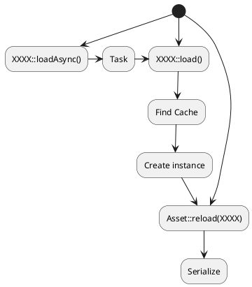
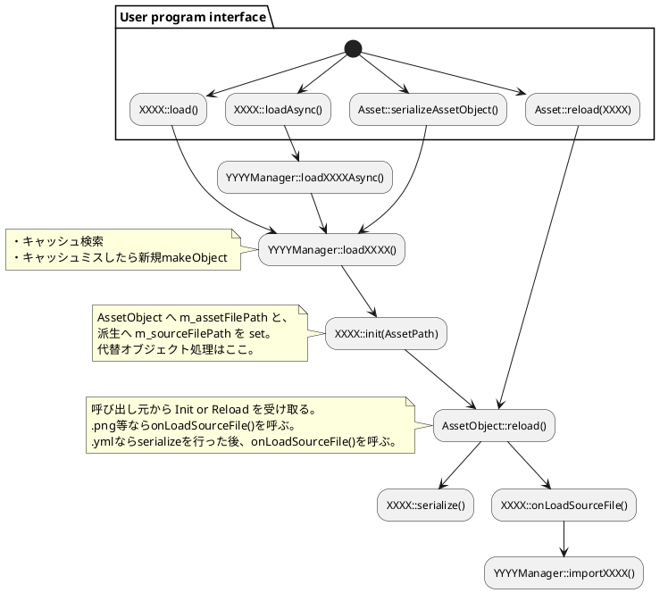

- ローカルファイルにフルパスでアクセスできるようにする。
- ローカルファイルとアーカイブファイルを透過的に扱えるようにする。
- Web上から HTTP でダウンロードできるようにする。
- 非同期読み込みできるようにする。
- リロードできるようにする。
- アセットが無いときは警告をレポートして続行し、代替アセットを使えるようにする。

ユーザープログラムへ公開する基本コード
----------

### Idea.1 (没)

```
auto texture = Texture2D::loadAsync("test.png");
if (texture->isLoading()) {
    // 読み込み中
}
if (!texture->isValid()) {
    // 読み込み失敗
}
sprite->setTexture(texture);    // 少なくとも null ではない
```

このパターンだと、全ての AssetObject が [利用可能][読み込み中][失敗] といった状態を持つことになる。
例えばテクスチャサイズに依存して要素の大きさを決めるようなことができない。

直観的ではあるのだが、状態が多くすごく mutable なオブジェクトになるので、取り回しはかなり複雑になってしまう。

### Idea.2

```
Texture2D::loadAsync("test.png")
    ->then([&](auto& texture) {
        if (!texture->isValid()) {
            // 読み込み失敗
        }
        sprite->setTexture(texture);
    });
```

JS の fetch と同じ仕組み。Three.js の GLTFLoader でも同じような仕組みを採用している。

texture->isValid() が false の場合は 代替アセット が使われている。
sprite->setTexture(texture); するとマゼンタテクスチャが表示される。

失敗=代替アセットにしたいので、catch は今のところ不要かも。

ただし場合によっては同期ロードを使いたいこともある。
ちょっとお試しコード書いたり、ラムダ関数を作れない言語へのBindingでは同期ロードをメインで使いたい。

```
auto texture = Texture2D::load("test.png");
```

同期ロードはこれまで通りの考え方。

null と代替アセット
----------

null はそもそもアセットを利用していない状態 (Texture なら、デフォルトの WhiteTexture)

代替アセットは読み込み失敗の状態 (Texture なら、MagentaTexture)


ユーザープログラムから見た、ロードの基本手順
----------



Import までの内部フロー
----------



#### バイナリデータなどから作成し、名前付き AssetObject として登録するには？

.gltf の埋め込みテクスチャや、プログラム内で生成したテクスチャを登録したいとき。

- 生成と登録は分けておく。
- 新規作成したときは、`YYYYManager::registerXXXX()` で AssetPath と共に登録する。
    - .gltf などファイルを基点に作った場合は / で区切った方がいいかも。
- リロードするときは、
    - まず YYYYManager::loadXXXX() で検索する。
    - 見つかった Object に生成処理を適用して、中身を書き換える。

#### CacheKey に拡張子は含めるべき？

```cpp
auto mesh1 = Mesh::load("mesh");      // .yml があればそちらを優先ロード
auto mesh2 = Mesh::load("mesh.gltf");
```

.yml をロードしたときも、importer に流れるときは mesh.gltf に解決されるので、埋め込みテクスチャがある場合、どちらも "mesh.gltf/img.png" が Cache に登録される。

でも埋め込みテクスチャを外部で明示的にロードしたいケースはないか…。

ひとまず「含める」で進めてみる。


AssetObject
----------

Object のサブクラス。Texture などのスーパークラス。
Asset file と 1:1 で対応する。

AssetObject::m_assetPath は アセットファイル (.yml) のパス。
.png 等から直接読み込んだ場合は Empty。

実装は Texture::m_sourceFilePath を持つ。
.png 等のパスはここに持ち、reload の時に使用する。

複数 Aseet の生成元となるファイルの reload
----------

glTF 等のファイルは、Mesh, Texture, Material, AnimationClip 等の生成元となる。

Assets::reload(Mesh) したら、Mesh の sourceFile に起因する Asset はすべてリロードする。

例えば .gltf はテクスチャが埋め込まれていることがあるが、それに関わらずすべてリロードする。
ただし、initialize の時のみ。ランタイム時はキャッシュ検索して同一リソースは共有したいため、常にリロードだとそれの障害となる。

拡張子の省略について
----------

HTTP とかで Web 上のファイルを load するときは省略不可能。サーバ側で探す必要があるため。
（ツクール MV はデータファイル上は拡張子を省略しているが、load するときに .png をつけていたりする）

Lumino は基本方針として、先に アーカイブファイルをダウンロードし、以降はその中身だけを読み取るような使い方になる。

もし `Texture2D::load("img/picture1.png")` HTTP fetch で Stream を得る でサーバまでデータを取りに行くなら、Archive を作ることになる。
ファイルインデックスをダウンロードするみたいな対策はいいかもしれない。

一方ユーザーデータを扱うために外部ファイルを入力できるようにするなら、`Texture2D::load("http://AAAA/img/picture1.png")` というのもありかもしれない。この場合は Path 先頭のスキーマを見ればいい。

引き続き、省略は可能、で行ってみる。


m_assetFilePath と m_assetSourcePath
----------

### m_assetFilePath

型は Path. コメントに書いた通り。

```
// ユーザープログラムから指定されたパス。リロードのために使用する。
// 絶対パスまたは相対パスで、相対パスの場合は Asset フォルダからの相対パス。
// これはユーザープログラムから指定されたパスをそのまま覚えておいてリロードで使用するためのものであって、
// 何かファイルに保存したりするものではない。
// リロードのたびに findAssetPath() で AssetPath に解決して使う。
// この性質上、開発中のみ使用し、リリースランタイムでは使用しない。
```

### m_assetSourcePath

型は AssetPath。Path ではない。

ただし、yml に保存するときはその yml ファイルの場所からの相対パスとなる点に注意。

なぜかというと、これを使うようなデータ表現は、元となるデータファイル (.png や .gltf) がまずあって、それに補足情報を加える形で .yml が存在することになるため。
これは Unity の .metadata のように、基本的に同じフォルダにおいて管理する。各種 load が拡張子を省略できるようになっているのも、このあたりを透過的に扱えるようにするため。

またそのような metadata 的な使い方のほか、特に yml を手書きするときに別 Asset の参照を相対パスで書きたいことがある。

そうすると プログラム内でも Path の相対パスで持っておいた方がよさそうに見えるのだが、
ファイルロードのためにこの相対パスを絶対パス (少なくとも Asset フォルダからの相対パス) に直すためには、yml ファイルの Path(m_assetFilePath 相当) を知らなければならない。

ここで問題なのが、yml ファイルに対応する Object と、今ここで考える m_assetSourcePath を持つ Object は遠く離れる可能性があるということ。

例えば、Level の yml をロードするとき、そのシーングラフの深いところにいる Sprite や Shader が持っている Texture をロードしたいとき。
ルートの yml のパスは serialize の引数から求めることができるが、その時点で結合して絶対パスとして m_assetSourcePath に保持しておかなければならない。
Texture 自身を load したときは、その時点で Asset フォルダからのパスをベースに解決して持っておく。


